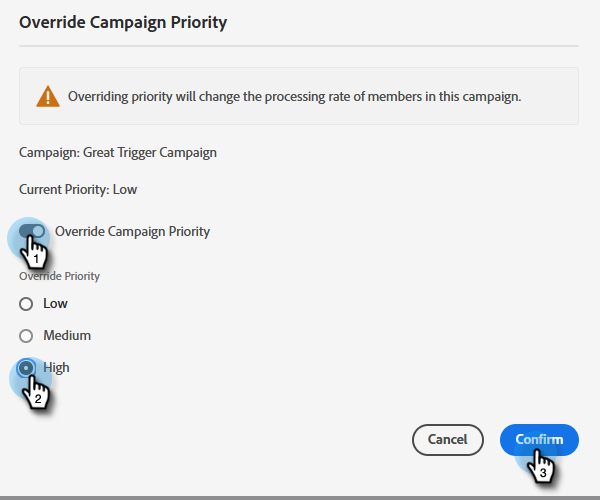

# 觸發促銷活動的優先順序覆寫 {#priority-override-for-trigger-campaigns}

管理員可以覆寫Marketo決定的優先順序，以觸發促銷活動，以設定更符合業務目標的優先順序。

>[!NOTE]
>
>此功能僅適用於觸發促銷活動，以及已授與 [「編輯觸發促銷活動優先順序」權限](#grant-priority-override-access).

>[!CAUTION]
>
>強烈建議您在有限的關鍵業務促銷活動集上使用此功能（建議最大值為25個）。 在大型群組上鬆散使用功能可能會對整體行銷活動執行造成負面影響。

## 授予優先順序覆蓋訪問權 {#grant-priority-override-access}

>[!NOTE]
>
>只有管理員或具有管理員職責的使用者才應具有促銷活動優先順序覆寫存取權。

1. 在 [!UICONTROL 管理] 按一下 **[!UICONTROL 使用者與角色]**.

   

1. 按一下 **[!UICONTROL 角色]** 頁簽，選擇要授予訪問權限的用戶，然後按一下 **[!UICONTROL 編輯角色]**.

   

1. 在 [!UICONTROL 存取行銷活動]，選取 **[!UICONTROL 編輯觸發程式促銷活動優先順序]**. 按一下 **[!UICONTROL 儲存]**.

   

## 覆蓋優先順序 {#override-priority}

1. 找出您的觸發程式促銷活動。 按一下右鍵並選擇 **[!UICONTROL 覆寫促銷活動優先順序]**.

   

1. 按一下 **[!UICONTROL 覆寫促銷活動優先順序]** 滑桿啟用。 選擇新的優先順序級別，然後按一下 **[!UICONTROL 確認]**.

   

   新的優先順序級別將顯示在「計畫」頁簽中。

   

>[!NOTE]
>
>* 您可以在 [!UICONTROL 促銷活動佇列] 在 [!UICONTROL 行銷活動]. 若要提高執行率，建議將促銷活動優先順序設定為高於其預設值的一個層級。
>* 使用者集優先順序僅適用於符合促銷活動資格的新使用者；已在佇列中的人員將不會受到影響。
>* 優先順序覆寫會擷取 [稽核軌跡](/help/marketo/product-docs/administration/audit-trail/audit-trail-overview.md).

