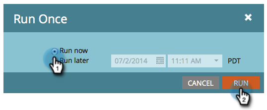

# 立即執行批次智慧型促銷活動 |計畫頁簽 {#run-a-batch-smart-campaign-now-schedule-tab}

建立完批次促銷活動後，您可以選擇立即或稍後執行。 下面是如何立即運行它。

1. 選取批次智慧型促銷活動，前往 **排程** 按一下 **執行一次**.

   

1. 請確定 **立即運行** 已選取，請按一下 **執行**.

   

1. 按一下以確認 **執行** 再來一次。

   

   小菜一碟！ 您也可以 [排程稍後執行](/help/marketo/product-docs/core-marketo-concepts/smart-campaigns/using-smart-campaigns/schedule-a-batch-smart-campaign-to-run-later.md) 如果你願意的話。

   >[!NOTE]
   >
   >* [排程批次智慧型促銷活動以稍後執行](/help/marketo/product-docs/core-marketo-concepts/smart-campaigns/using-smart-campaigns/schedule-a-batch-smart-campaign-to-run-later.md)
   >* [排程循環批次促銷活動](/help/marketo/product-docs/core-marketo-concepts/smart-campaigns/using-smart-campaigns/schedule-a-recurring-batch-campaign.md)

