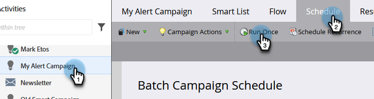

# 立即執行批次智慧行銷活動 | 排程索引標籤 {#run-a-batch-smart-campaign-now-schedule-tab}

建立完批次行銷活動後，您可以選擇現在或稍後執行。

1. 選取批次促銷活動，前往&#x200B;**[!UICONTROL Schedule]**&#x200B;標籤，然後按一下&#x200B;**[!UICONTROL Run Once]**。

   

1. 確定已選取&#x200B;**[!UICONTROL Run Now]**&#x200B;並按一下&#x200B;**[!UICONTROL Run]**。

   

1. 再按一次&#x200B;**[!UICONTROL Run]**&#x200B;以確認。

   

   您也可以[排程稍後執行](/help/marketo/product-docs/core-marketo-concepts/smart-campaigns/using-smart-campaigns/schedule-a-batch-smart-campaign-to-run-later.md){target="_blank"} （如果您願意）。

   >[!NOTE]
   >
   >* [排程批次智慧行銷活動以稍後執行](/help/marketo/product-docs/core-marketo-concepts/smart-campaigns/using-smart-campaigns/schedule-a-batch-smart-campaign-to-run-later.md){target="_blank"}
   >* [排程週期性批次行銷活動](/help/marketo/product-docs/core-marketo-concepts/smart-campaigns/using-smart-campaigns/schedule-a-recurring-batch-campaign.md){target="_blank"}
