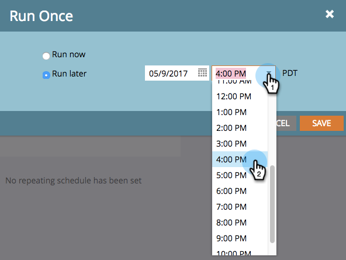

# 排程批次智慧型促銷活動以稍後執行{#schedule-a-batch-smart-campaign-to-run-later}

如果您想要將批次智慧型促銷活動設定為在未來某個時間點執行，請以下說明方法。

>[!TIP]
>
>您也可以[在方案計畫視圖](/help/marketo/product-docs/core-marketo-concepts/programs/program-schedule-view/reschedule-a-batch-smart-campaign-in-the-program-schedule-view.md)中重新計畫批智慧型促銷活動。

1. 選擇您要執行的批次智慧型促銷活動，前往&#x200B;**排程**&#x200B;標籤，然後按一下&#x200B;**執行一次**。

   

1. 按一下「稍後執行&#x200B;**」，然後按一下日曆圖示並選取您要智慧型促銷活動執行的日期。**

   

1. 選擇您希望智慧型促銷活動在的執行時間（至少提前15分鐘）。

   

1. 按一下&#x200B;**保存**。

   

1. 您可以查看&#x200B;**Schedule**&#x200B;標籤來確認計畫運行。

   

   >[!NOTE]
   >
   >[排程循環批次促銷活動](/help/marketo/product-docs/core-marketo-concepts/smart-campaigns/using-smart-campaigns/schedule-a-recurring-batch-campaign.md)
