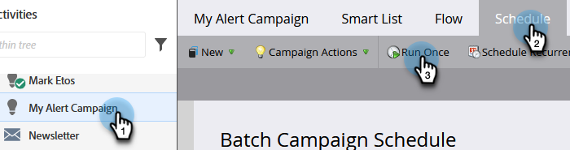
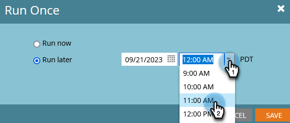

# 安排批次智慧行銷活動於稍後執行 {#schedule-a-batch-smart-campaign-to-run-later}

如果您想要將批次行銷活動設定為在未來的某個時間點執行，以下說明步驟。

>[!TIP]
>
>您也可以在方案排程檢視中[重新排程批次智慧行銷活動](/help/marketo/product-docs/core-marketo-concepts/programs/program-schedule-view/reschedule-a-batch-smart-campaign-in-the-program-schedule-view.md){target="_blank"}。

1. 選取您要執行的批次智慧行銷活動，前往&#x200B;**[!UICONTROL Schedule]**&#x200B;標籤，然後按一下&#x200B;**[!UICONTROL Run Once]**。

   

1. 按一下&#x200B;**[!UICONTROL Run later]**，然後按一下行事曆圖示，並選取您要執行智慧行銷活動的日期。

   

1. 選取您要智慧型行銷活動執行的時間（至少提前15分鐘）。

   

1. 按一下「**[!UICONTROL Save]**」。

   

1. 您可以檢視&#x200B;**[!UICONTROL Schedule]**&#x200B;索引標籤以確認排定的執行。

   

   >[!NOTE]
   >
   >[排程週期性批次行銷活動](/help/marketo/product-docs/core-marketo-concepts/smart-campaigns/using-smart-campaigns/schedule-a-recurring-batch-campaign.md){target="_blank"}
