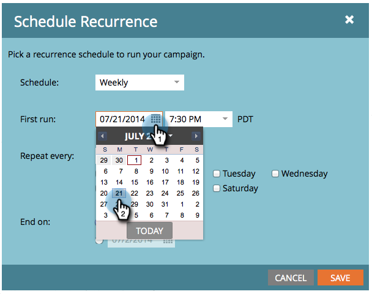
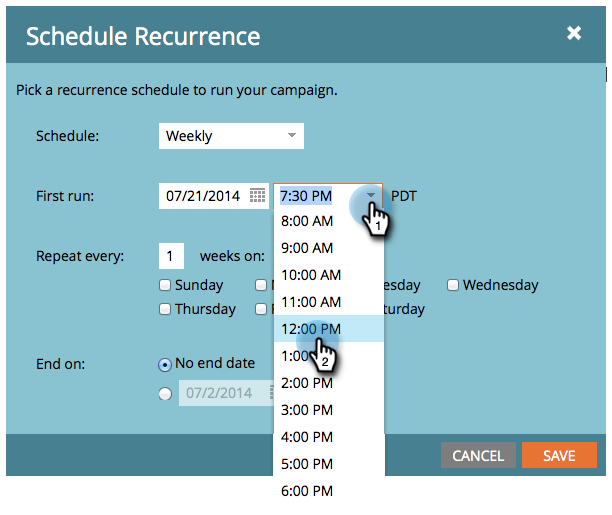

# 排程循環批次促銷活動 {#schedule-a-recurring-batch-campaign}

週期可讓您定期執行批次智慧型促銷活動。 例如，每週一次，星期一中午12:00。

1. 選取促銷活動，前往「排程」標籤，然後按一下 **排程週期**.

   

1. 按一下「排程」下拉式清單，然後選取 **每週**.

   

1. 按一下日曆圖示，然後選取第一次執行的日期。 在此範例中，我們使用下一個星期一提供的。

   

1. 選取執行該作業的時間。

   

1. 將「重複間隔」保留為1，選擇「星期一」，然後按一下 **儲存**.

   

1. 您可以在「計畫」標籤下看到要驗證的計畫遞歸。

   

>[!NOTE]
>
>「排程」索引標籤會顯示接下來三個發生次數以供參考。

就這樣！ 您的批次促銷活動現在將於每星期一中午執行。
