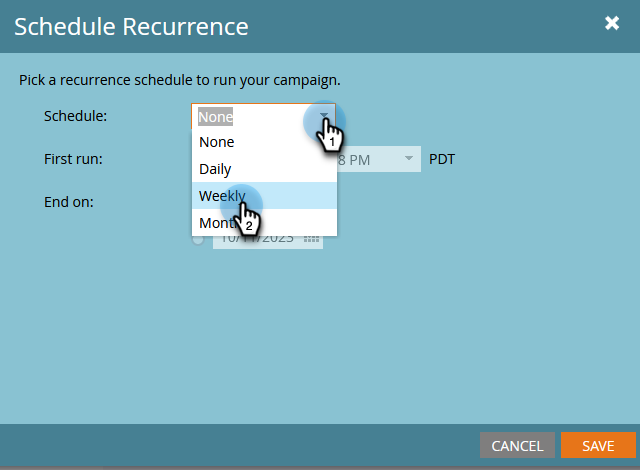
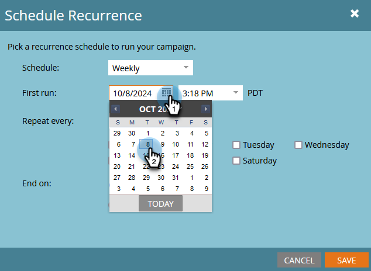

# 安排定期批次行銷活動的時間 {#schedule-a-recurring-batch-campaign}

週期可讓您定期執行批次行銷活動。 例如 — 每週一次，星期二上午10:00。

1. 選取Smart Campaign，前往&#x200B;**[!UICONTROL Schedule]**&#x200B;標籤，然後按一下&#x200B;**[!UICONTROL Schedule Recurrence]**。

   

1. 按一下「**[!UICONTROL Schedule]**」下拉式選單，選取「**[!UICONTROL Weekly]**」。

   

1. 按一下行事曆圖示，然後選取第一次執行的所需日期。

   

1. 選取它應該執行的時間。

   

1. 保留&quot;[!UICONTROL Repeat every]&quot;為1，選取星期二並按一下&#x200B;**[!UICONTROL Save]**。

   

   >[!NOTE]
   >
   >針對特定的執行長度，您可以按一下&#x200B;**[!UICONTROL End on]**&#x200B;旁的行事曆圖示並選擇結束日期。

排定的遞回專案會顯示在「排程」索引標籤的底部。

>[!NOTE]
>
>Schedule索引標籤會顯示後續三個發生次數以供參考。 按一下紅色的&#x200B;**X**&#x200B;將取消該特定執行。
