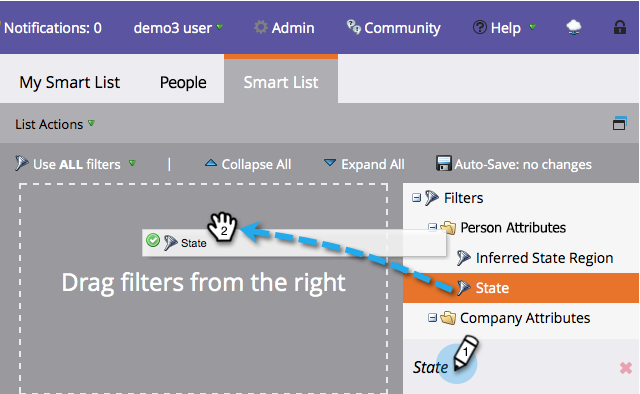

# 尋找篩選器並將其新增至智慧清單 {#find-and-add-filters-to-a-smart-list}

一旦您擁有 [已建立智慧清單](/help/marketo/product-docs/core-marketo-concepts/smart-lists-and-static-lists/creating-a-smart-list/create-a-smart-list.md)，您需要新增和 [定義](/help/marketo/product-docs/core-marketo-concepts/smart-lists-and-static-lists/creating-a-smart-list/define-smart-list-filters.md) 篩選條件。 以下說明如何尋找和新增篩選器。

在此範例中，讓我們尋找評分超過50分的所有加州人。

>[!TIP]
>
>探索右側的樹狀結構 — 篩選器功能非常強大，而且可能具有多種功能。

1. 前往 **行銷活動**.

   

1. 選取您要新增濾鏡的智慧清單，然後按一下 **智慧清單** 標籤。

   

1. 尋找並拖曳 **州** 篩選至畫布上。

   

1. 同時尋找並拖曳 **分數** 篩選過去。

   

完美！ 讓我們繼續定義這些篩選器。

>[!MORELIKETHIS]
>
>* [建立智慧清單](/help/marketo/product-docs/core-marketo-concepts/smart-lists-and-static-lists/creating-a-smart-list/create-a-smart-list.md)
>* [定義智慧清單篩選器](/help/marketo/product-docs/core-marketo-concepts/smart-lists-and-static-lists/creating-a-smart-list/define-smart-list-filters.md)
