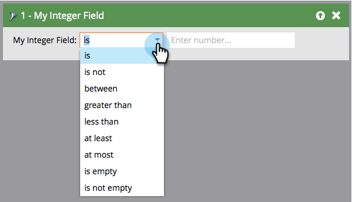

# 智慧清單篩選器運運算元字彙表 {#smart-list-filter-operators-glossary}

運運算元是智慧清單的一部分，可協助您取得特定值。 它可讓您以直截了當的語言描述您的篩選器或觸發器。 每種欄位型別的可用運運算元都不同。

以下辭彙表說明每組運運算元。

## 日期欄位 {#date-fields}

當您選擇運運算元時，右側會動態變更。

| 運算子 | 右側 | 說明 |
|---|---|---|
| 是 | 單一日期 | 完全相符的日期 |
| 不是 | 單一日期 | 任何日期，指定的日期除外 |
| 介於 | 兩個日期欄位 | 包含和介於兩個指定日期之間的任何日期 |
| 在過去 | 自然語言輸入&#42; | 請參閱下圖 |
| 在過去早於 | 自然語言輸入&#42; | 請參閱下圖 |
| 在未來 | 自然語言輸入&#42; | 請參閱下圖 |
| 在未來晚於 | 自然語言輸入&#42; | 請參閱下圖 |
| 在時間段 | 預設集（上一季、昨天等） | 在挑選清單中定義 |
| 晚於 | 單一日期 | 指定日期之後的所有記錄 |
| 早於 | 單一日期 | 指定記錄之前的所有記錄 |
| 在或晚於 | 單一日期 | 與「after」相同，但包含 |
| 在或早於 | 單一日期 | 與「之前」相同，但具包容性 |
| 是空的 | 無 | 沒有日期的所有記錄 |
| 不是空的 | 無 | 包含任何日期的所有記錄 |

&#42; 自然語言輸入很酷。 以下是您可以輸入的一些模式：

* 1小時
* 82天
* 3週
* 14個月
* 1年

只要輸入數字和單位就行了！

>[!NOTE]
>
>&quot;過去&quot; **會** 包含您建立智慧清單的日期（直到時間，而不是之後）。

>[!CAUTION]
>
>當您使用日期欄位篩選來建立智慧清單時（例如，出生日期、SFDC建立日期），並使用限制 **早於**， **在或早於**，或 **過去之前**，智慧清單也會包含該日期欄位中沒有值的人員。

請使用下圖來瞭解日期運運算元之間的差異。

>[!NOTE]
>
>**範例**
>
>當您處理過去和未來的事件時，日期欄位可能會很棘手。 以下是一些範例。
>
>**過去時間**
>
>對於新的促銷活動，使用此運運算元傳送電子郵件給未在一年內訂閱或續約您的服務，或從未訂閱的人。
>
>**在未來，晚於**
>
>假設您想檢視在90天內需要續約的客戶。 您可以使用兩個不同的篩選器。 第一次使用「未來90天後」，第二次使用「未來91天」。 這會擷取從現在起的90天後的日期。

## 字串欄位 {#string-fields}

| 運算子 | 說明 |
|---|---|
| 是 | 完全相符（不區分大小寫） |
| 不是 | 除了完全相符專案以外的任何專案 |
| 開頭為 | 字串比對的第一個字母 |
| 開頭不是 | 字串的第一個字母不相符 |
| 包含 | 字串中的任何字母都相符（例如：加州、福州、尤其） |
| 不包含 | 字串中沒有相符的字母。 （「包含」的反轉） |
| 是空的 | 沒有值(NULL)的記錄 |
| 不是空的 | 具有任何值的記錄 |

>[!TIP]
>
>使用正運運算元而非負運運算元。 「不是」篩選器必須搜尋您執行個體中的整個資料集，這可能非常耗時。 正面的「is」篩選器可運用更有效的搜尋演演算法。

## 整數欄位 {#integer-fields}

<table> 
 <thead> 
  <tr> 
   <th colspan="1" rowspan="1">運算子</th> 
   <th colspan="1" rowspan="1">說明</th> 
  </tr> 
 </thead> 
 <tbody> 
  <tr> 
   <td colspan="1" rowspan="1">是</td> 
   <td colspan="1" rowspan="1">完全相符的數字( = 0會傳回兩個具有0的銷售機會 <em>和</em> NULL)</td> 
  </tr> 
  <tr> 
   <td colspan="1" rowspan="1">不是</td> 
   <td colspan="1" rowspan="1">除了精確數字相符之外的任何專案</td> 
  </tr> 
  <tr> 
   <td colspan="1" rowspan="1">介於</td> 
   <td colspan="1" rowspan="1">定義兩個值以尋找介於兩者之間的所有人（包含）</td> 
  </tr> 
  <tr> 
   <td colspan="1" rowspan="1">大於</td> 
   <td colspan="1" rowspan="1">高於指定的</td> 
  </tr> 
  <tr> 
   <td colspan="1" rowspan="1">小於</td> 
   <td colspan="1" rowspan="1">小於指定的</td> 
  </tr> 
  <tr> 
   <td colspan="1" rowspan="1">至少</td> 
   <td colspan="1" rowspan="1">高於指定的（含）</td> 
  </tr> 
  <tr> 
   <td colspan="1" rowspan="1">最多</td> 
   <td colspan="1" rowspan="1">小於指定的（包含）</td> 
  </tr> 
  <tr> 
   <td colspan="1" rowspan="1">是空的</td> 
   <td colspan="1" rowspan="1">沒有值(NULL)的記錄 — 零是數字，它是 <em>非</em> 空</td> 
  </tr> 
  <tr> 
   <td colspan="1" rowspan="1">不是空的</td> 
   <td colspan="1" rowspan="1">具有任何值（包括零）的記錄</td> 
  </tr> 
 </tbody> 
</table>

如您所見，這些操作員可讓您輕鬆講流利的Marketo文！
