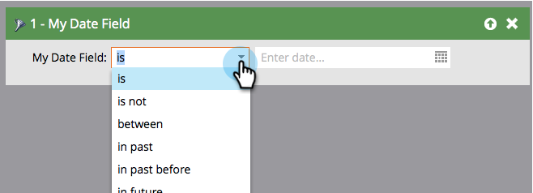

# 智慧清單篩選器運算子字彙表 {#smart-list-filter-operators-glossary}

運運算元是智慧清單的一部分，可協助您取得特定的。 它可讓您以直截了當的語言描述您的篩選器或觸發器。 每種欄位型別的可用運運算元都不同。

以下辭彙表說明每組運運算元。

## 日期欄位 {#date-fields}

當您選擇運運算元時，右側會動態變更。

<table><thead>
  <tr>
    <th>運算子</th>
    <th>右側</th>
    <th>說明</th>
  </tr></thead>
<tbody>
  <tr>
    <td>是</td>
    <td>單一日期</td>
    <td>完全相符的日期</td>
  </tr>
  <tr>
    <td>不是</td>
    <td>單一日期</td>
    <td>任何日期，指定的日期除外</td>
  </tr>
  <tr>
    <td>介於</td>
    <td>兩個日期欄位</td>
    <td>包含和介於兩個指定日期之間的任何日期</td>
  </tr>
  <tr>
    <td>在過去</td>
    <td>自然語言輸入*</td>
    <td>請參閱下圖</td>
  </tr>
  <tr>
    <td>在過去早於</td>
    <td>自然語言輸入*</td>
    <td>請參閱下圖</td>
  </tr>
  <tr>
    <td>在未來</td>
    <td>自然語言輸入*</td>
    <td>請參閱下圖</td>
  </tr>
  <tr>
    <td>在未來晚於</td>
    <td>自然語言輸入*</td>
    <td>請參閱下圖</td>
  </tr>
  <tr>
    <td>在時間段</td>
    <td>預設集（上一季、昨天等）</td>
    <td>在挑選清單中定義</td>
  </tr>
  <tr>
    <td>晚於</td>
    <td>單一日期</td>
    <td>指定日期之後的所有記錄</td>
  </tr>
  <tr>
    <td>早於</td>
    <td>單一日期</td>
    <td>指定記錄之前的所有記錄</td>
  </tr>
  <tr>
    <td>在或晚於</td>
    <td>單一日期</td>
    <td>與「after」相同，但包含</td>
  </tr>
  <tr>
    <td>在或早於</td>
    <td>單一日期</td>
    <td>與「之前」相同，但具包容性</td>
  </tr>
  <tr>
    <td>是空的</td>
    <td>None</td>
    <td>沒有日期的所有記錄</td>
  </tr>
  <tr>
    <td>不是空的</td>
    <td>None</td>
    <td>包含任何日期的所有記錄</td>
  </tr>
</tbody></table>

**&#42;**&#x200B;自然語言輸入很酷。 以下是您可以輸入的一些模式：

* 1 小時
* 82 天
* 3 週
* 14 個月
* 1 年

只要輸入數字和單位就行了！

>[!NOTE]
>
>「過去」_會_&#x200B;包含您建立智慧清單的日期（直到該時間，而不是之後）。

>[!CAUTION]
>
>當您使用日期欄位篩選器(例如，出生日期、SFDC建立日期)建立智慧清單，並使用限制&#x200B;**[!UICONTROL before]**、**[!UICONTROL on or before]**&#x200B;或&#x200B;**[!UICONTROL in past before]**&#x200B;時，智慧清單也會包含該日期欄位中沒有值的人員。

請使用下圖來瞭解日期運運算元之間的差異。

>[!NOTE]
>
>**範例**
>
>當您處理過去和未來的事件時，日期欄位可能會很棘手。 以下是一些範例。
>
>**[!UICONTROL In past before]**
>
>對於新的促銷活動，使用此運運算元傳送電子郵件給未在一年內訂閱或續約您的服務，或從未訂閱的人。
>
>**[!UICONTROL In future after]**
>
>假設您想檢視在90天內需要續約的客戶。 您可以使用兩個不同的篩選器。 第一次使用「未來90天後」，第二次使用「未來91天」。 這會擷取從現在起的90天後的日期。

## 字串欄位 {#string-fields}

<table><thead>
  <tr>
    <th>運算子</th>
    <th>說明</th>
  </tr></thead>
<tbody>
  <tr>
    <td>是</td>
    <td>完全相符（不區分大小寫）</td>
  </tr>
  <tr>
    <td>不是</td>
    <td>除了完全相符專案以外的任何專案</td>
  </tr>
  <tr>
    <td>開頭為</td>
    <td>字串比對的第一個字母</td>
  </tr>
  <tr>
    <td>開頭不是</td>
    <td>字串的第一個字母不相符</td>
  </tr>
  <tr>
    <td>包含</td>
    <td>字串中的任何字母都相符（例如：加州、福州、尤其）</td>
  </tr>
  <tr>
    <td>不包含</td>
    <td>字串中沒有相符的字母。 （「包含」的反轉）</td>
  </tr>
  <tr>
    <td>是空的</td>
    <td>沒有值(NULL)的記錄</td>
  </tr>
  <tr>
    <td>不是空的</td>
    <td>具有任何值的記錄</td>
  </tr>
</tbody>
</table>

>[!TIP]
>
>使用正運運算元而非負運運算元。 「不是」篩選器必須搜尋您執行個體中的整個資料集，這可能非常耗時。 正面的「is」篩選器可運用更有效的搜尋演演算法。

## 整數欄位 {#integer-fields}

<table><thead>
  <tr>
    <th>運算子</th>
    <th>說明</th>
  </tr></thead>
<tbody>
  <tr>
    <td>是</td>
    <td>完全相符的數字（ = 0會傳回兩個具有0和NULL的銷售機會）</td>
  </tr>
  <tr>
    <td>不是</td>
    <td>除了精確數字相符之外的任何專案</td>
  </tr>
  <tr>
    <td>介於</td>
    <td>定義兩個值以尋找介於兩者之間的所有人（包含）</td>
  </tr>
  <tr>
    <td>大於</td>
    <td>高於指定的</td>
  </tr>
  <tr>
    <td>小於</td>
    <td>小於指定的</td>
  </tr>
  <tr>
    <td>至少</td>
    <td>高於指定的（含）</td>
  </tr>
  <tr>
    <td>最多</td>
    <td>小於指定的（包含）</td>
  </tr>
  <tr>
    <td>是空的</td>
    <td>沒有值(NULL)的記錄 — 零是數字，不是NULL</td>
  </tr>
  <tr>
    <td>不是空的</td>
    <td>具有任何值（包括零）的記錄</td>
  </tr>
</tbody>
</table>

如您所見，這些操作員可讓您輕鬆講流利的Marketo文！
