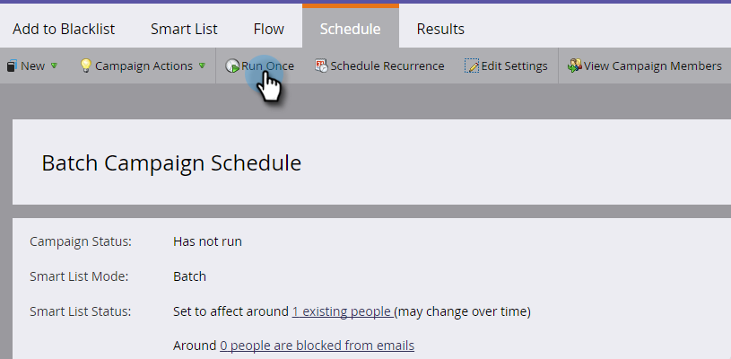

# 將人添加到塊清單{#add-person-to-blocklist}

將人員添加到塊清單會阻止他們接收您的通信。

>[!NOTE]
>
>Marketo正在將產品中的黑名單和白名單等術語更改為區塊名單和允許名單。 在此更新期間，您可能會在我們的UI和檔案螢幕擷取畫面中看到舊有的詞語，在檔案文字中看到新的詞語。 我們為任何混淆表示歉意。

1. [建立新的預設](/help/marketo/product-docs/core-marketo-concepts/programs/creating-programs/create-a-program.md) 程式並將其命 **名為「添加到塊清單」**。

1. 按一下&#x200B;**新建**&#x200B;並選擇&#x200B;**新建本地資產**。

   

1. 命名清單，然後按一下&#x200B;**建立**。

   

1. 將所有人員添加到要添加到塊清單的&#x200B;**智慧清單**&#x200B;中。

   >[!NOTE]
   >
   >區塊清單上的人將不會收到操作電子郵件。

   

1. 按一下「**新增**」並選取「新增智慧型促銷活動」。****

   

1. 將&#x200B;**命名為新智慧型促銷活動**。 按一下&#x200B;**建立**。

   

1. 拖放&#x200B;**智慧清單成員**。

   

1. 選擇剛建立的智慧清單。

   

1. 拖放&#x200B;**變更資料值**。

   

1. 對於&#x200B;**Flow**，為&#x200B;**Attribute**&#x200B;輸入&#x200B;**Block Listed**，並將&#x200B;**New Value**&#x200B;設定為&#x200B;**true**。

   

1. 在&#x200B;**計畫**&#x200B;標籤上，選擇&#x200B;**運行一次**。

   

1. 選擇&#x200B;**立即運行**&#x200B;並按一下&#x200B;**運行**。

   

   耶！ 這些人將不再收到電子郵件。

   >[!TIP]
   >
   >使用&#x200B;**變更資料值**&#x200B;及&#x200B;**區塊清單為true**&#x200B;的[觸發智慧型促銷活動](/help/marketo/product-docs/core-marketo-concepts/smart-campaigns/creating-a-smart-campaign/create-a-new-smart-campaign.md)，為未來具有區塊清單屬性的所有人建立。
