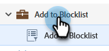

# 將個人新增至封鎖清單 {#add-person-to-blocklist}

將人員新增至您的封鎖清單會防止他們收到您的信件。

1. 建立新的[預設程式](/help/marketo/product-docs/core-marketo-concepts/programs/creating-programs/create-a-program.md){target="_blank"}，並將其命名為「加入封鎖清單」。

1. 按一下&#x200B;**[!UICONTROL New]**&#x200B;並選取&#x200B;**[!UICONTROL New Local Asset]**。

   

1. 選擇「**[!UICONTROL Smart List]**」。

   

1. 為清單命名，然後按一下&#x200B;**[!UICONTROL Create]**。

   

1. 將所有人員新增至您的智慧清單中，以便將其新增至封鎖清單中。

   

   >[!NOTE]
   >
   >封鎖清單上的人員不會收到操作電子郵件。

1. 返回您的程式。

   

1. 按一下&#x200B;**[!UICONTROL New]**&#x200B;並選取&#x200B;**[!UICONTROL New Smart Campaign]**。

   

1. 為新的Smart Campaign命名。 按一下「**[!UICONTROL Create]**」。

   

1. 拖放&#x200B;**[!UICONTROL Member of Smart List]**。

   

1. 選取您剛建立的智慧清單。

   

1. 按一下「**[!UICONTROL Flow]**」標籤。 拖放&#x200B;**[!UICONTROL Change Data Value]**&#x200B;流量動作。

   

1. 在&#x200B;**[!UICONTROL Attribute]**&#x200B;下拉式清單中選取&#x200B;**[!UICONTROL Block Listed]**&#x200B;並將&#x200B;**[!UICONTROL New Value]**&#x200B;設為&#x200B;**[!UICONTROL true]**。

   

1. 按一下「**[!UICONTROL Schedule]**」索引標籤並選取「**[!UICONTROL Run Once]**」。

   

1. 選取&#x200B;**[!UICONTROL Run Now]**&#x200B;並按一下&#x200B;**[!UICONTROL Run]**。

   

1. 再按一下&#x200B;**[!UICONTROL Run]**。

   

這些人將不再收到電子郵件。

>[!TIP]
>
>使用[變更資料值](/help/marketo/product-docs/core-marketo-concepts/smart-campaigns/creating-a-smart-campaign/create-a-new-smart-campaign.md){target="_blank"}建立&#x200B;**觸發行銷活動**，其中列出的&#x200B;**區塊為True**，適用於未來所有具有可列入封鎖清單屬性的人員。
