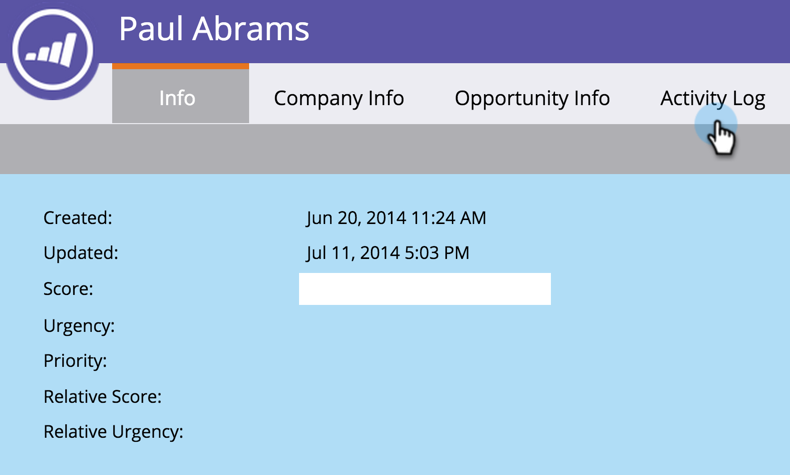
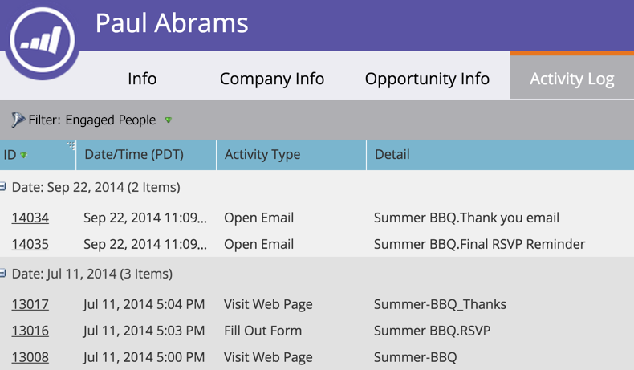

# 在人員的活動記錄中篩選活動型別 {#filter-activity-types-in-the-activity-log-of-a-person}

在活動記錄中搜尋對您而言最重要的活動。

>[!NOTE]
>
>進一步瞭解 [活動記錄](/help/marketo/product-docs/core-marketo-concepts/smart-lists-and-static-lists/managing-people-in-smart-lists/locate-the-activity-log-for-a-person.md).

1. 前往 **個人詳細資料** 頁面。 按一下 **活動記錄** 標籤。

   

1. 選取 **篩選** 下拉式清單。

   

## 建立自訂篩選器 {#creating-custom-filters}

1. 按一下 **篩選** 下拉式清單。 選取 **自訂**.

   

1. 選取篩選依據的活動。 按一下 **另存為**.

   

1. 輸入 **自訂篩選器名稱**. 按一下 **儲存**.

   

   現在，只會顯示符合篩選器條件的人員活動。

   

## 參考已儲存的篩選器 {#reference-saved-filters}

已儲存的篩選器可從以下位置存取： **篩選** 下拉式清單。

1. 按一下 **篩選器** 下拉式清單。 選取 **自訂**.

   

1. 按一下 **儲存的篩選器**. 儲存的篩選器列於下方。

   
