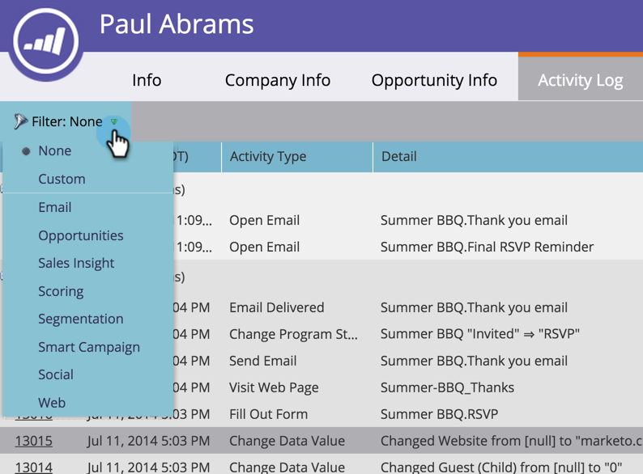

# 篩選{#filter-activity-types-in-the-activity-log-of-a-person}人員活動記錄中的活動類型

在活動日誌中搜索對您最重要的活動。

>[!NOTE]
>
>進一步瞭解[活動日誌](/help/marketo/product-docs/core-marketo-concepts/smart-lists-and-static-lists/managing-people-in-smart-lists/locate-the-activity-log-for-a-person.md)。

1. 轉至&#x200B;**人員詳細資訊**&#x200B;頁。 按一下&#x200B;**活動日誌**&#x200B;頁籤。

   

1. 選擇&#x200B;**Filter**&#x200B;下拉式清單。

   

## 建立自訂篩選器{#creating-custom-filters}

1. 按一下「**篩選**」下拉式清單。 選擇&#x200B;**Custom**。

   

1. 選擇要篩選的活動。 按一下「另存新檔」。****

   

1. 輸入&#x200B;**自訂篩選器名稱**。 按一下&#x200B;**保存**。

   

   現在，只會顯示符合篩選條件的人員活動。

   

## 參考已儲存的篩選器{#reference-saved-filters}

可從&#x200B;**Filter**&#x200B;下拉式清單存取儲存的篩選器。

1. 按一下「**篩選器**」下拉式清單。 選擇&#x200B;**Custom**。

   

1. 按一下「**保存的過濾器**」。 已儲存的篩選器列於下方。

   
