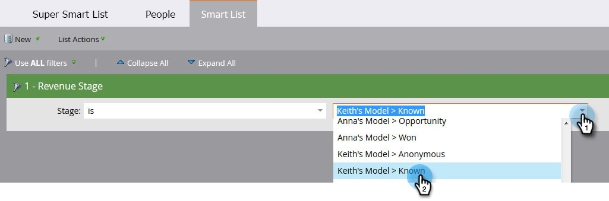

# 在收入階段{#find-all-people-in-a-revenue-stage}中尋找所有人

>[!PREREQUISITES]
>
>[建立智慧清單](/help/marketo/product-docs/core-marketo-concepts/smart-lists-and-static-lists/creating-a-smart-list/create-a-smart-list.md)

## 查找特定收入階段{#find-all-members-of-a-specific-revenue-stage}的所有成員

1. 在智慧型清單中，按一下「智慧型清單」標籤，尋找「收入階段」篩選器，並將它拖曳至畫布中。********

   

1. 選擇&#x200B;**收入階段**。

   

1. 前往&#x200B;**People**&#x200B;標籤以檢視結果。

   

## 在收入階段{#run-a-flow-step-on-the-members-of-a-revenue-stage}的成員上運行流步驟

既然您知道哪些人處於收入階段，您就可以直接向他們行銷。 除了選擇&#x200B;**收入階段**&#x200B;做為智慧型清單篩選外，您也可以選擇它作為流中的「if」篩選。

1. 在所要的流程步驟中，按一下「新增選擇」，然後從下拉式清單中選取「收入階段」。********

   

   您可以從中選擇哪些成員受流程步驟的哪個方面的影響。 好玩！
