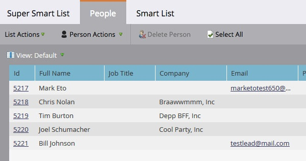

# 尋找收入階段的所有人員 {#find-all-people-in-a-revenue-stage}

>[!PREREQUISITES]
>
>[建立智慧清單](/help/marketo/product-docs/core-marketo-concepts/smart-lists-and-static-lists/creating-a-smart-list/create-a-smart-list.md){target="_blank"}

## 尋找特定收入階段的所有成員 {#find-all-members-of-a-specific-revenue-stage}

1. 在智慧清單中，按一下&#x200B;**[!UICONTROL 智慧清單]**&#x200B;索引標籤，尋找&#x200B;**[!UICONTROL 收入階段]**&#x200B;篩選器，並將其拖曳至畫布中。

   

1. 選取&#x200B;**[!UICONTROL 收入階段]**。

   

1. 移至&#x200B;**[!UICONTROL 人員]**&#x200B;標籤以檢視結果。

   

## 在收入階段成員上執行流程步驟 {#run-a-flow-step-on-the-members-of-a-revenue-stage}

現在您已經知道哪些人員處於收入階段，您可以直接向他們行銷。 除了選擇&#x200B;**[!UICONTROL 收入階段]**&#x200B;作為智慧列示篩選器之外，您也可以在流程中選擇它作為「if」篩選器。

1. 在所需的流程步驟中，按一下&#x200B;**[!UICONTROL 新增選擇]**，然後從下拉式清單中選取&#x200B;**[!UICONTROL 收入階段]**。

   

   從那裡，您可以選擇哪些成員受到流程步驟哪個方面的影響。
