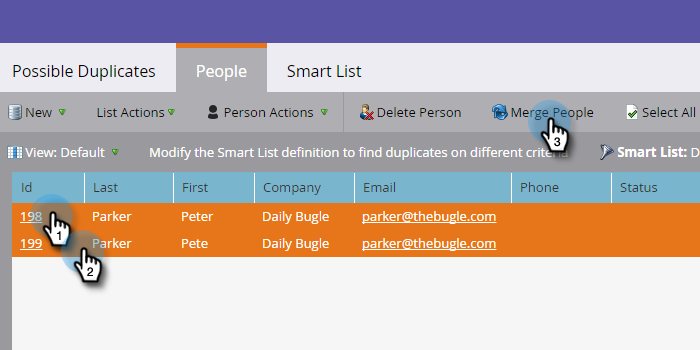

# 查找和合併重複人員 {#find-and-merge-duplicate-people}

Marketo會在新人員進入系統時自動去重複化。 不過，您的CRM最初可能已將重複項目傳送至Marketo。 以下說明如何合併這些參數。

>[!NOTE]
>
>Marketo不會針對Salesforce或Microsoft Dynamics同步，或當您手動輸入人員時，自動消除重複資料。

>[!PREREQUISITES]
>
>查找和合併重複項將涉及使用 [內置/系統智慧清單](/help/marketo/product-docs/core-marketo-concepts/smart-lists-and-static-lists/using-smart-lists/use-built-in-system-smart-lists.md).

## 查找重複項 {#find-duplicates}

1. 前往 **資料庫** 的上界。

   

   >[!CAUTION]
   >
   >如果您使用Salesforce人員帳戶，在Marketo中合併人員可能無法運作。 如果可能，請合併Salesforce中的記錄。

1. 選取 **可能的重複項** 系統智慧清單，然後按一下 **人員** 標籤。

   

   >[!NOTE]
   >
   >您也可以 [使用自訂邏輯尋找重複人員](/help/marketo/product-docs/core-marketo-concepts/smart-lists-and-static-lists/managing-people-in-smart-lists/find-duplicate-people-with-custom-logic.md).

## 手動合併人員 {#merge-people-manually}

>[!CAUTION]
>
>合併人員時，如果失去的人員有Marketo自訂物件，則會 **not** 重新關聯至獲勝者。 執行合併之前，請重新為自訂物件上層。

1. 按住Ctrl/Cmd並按一下，然後按一下，以選取重複項目 **合併人員**.

   

   >[!TIP]
   >
   >您可以為同一人有兩個或多個重複項目 — 一次選取全部。

1. 您會看到記錄之間的值 _don&#39;t_ 相符。 為每個欄位選取您要保留的值。 按一下 **合併** 時才能使用。 如果您不需要任一值，可以檢查 **自訂** 並輸入您所選擇的值。

   

   >[!NOTE]
   >
   >手動合併人員時，第一個選取的人員會是「獲勝者」。 因此，在「人物」標籤中，如果您正在合併198和199的記錄ID，而您碰巧先按一下199，則199會是合併後人員的記錄ID。 合併兩個以上記錄時，也適用這種情況。

   >[!TIP]
   >
   >合併比刪除好。 您會保留所有歷史記錄（頁面瀏覽、連結點按、電子郵件開啟、表單填入等）。

## Salesforce中的效果 {#effect-in-salesforce}

如果您有Salesforce整合，則會提供一些關於Salesforce中「合併銷售機會」的效果的附註。

* 當僅合併Lead或僅合併Contact時，它們將按照常規Salesforce規則合併。
* 將Lead和Contact合併在一起時，在按照常規Salesforce規則合併之前，所有Lead都會轉換為Contact。

有關合併Lead或Contact時Salesforce行為的詳細資訊，請查看以下Salesforce文檔：

* [合併重複銷售機會](https://help.salesforce.com/HTViewHelpDoc?id=leads_merge.htm&amp;language=en_US)
* [合併重複聯繫人](https://help.salesforce.com/HTViewHelpDoc?id=contacts_merge.htm&amp;language=en_US)

## 大量合併 {#bulk-merging}

如果手動合併重複項目太多，請連絡Adobe客戶團隊（您的客戶經理）以討論您的選項。

如果您已連線至CRM，記錄會根據下列規則合併。
