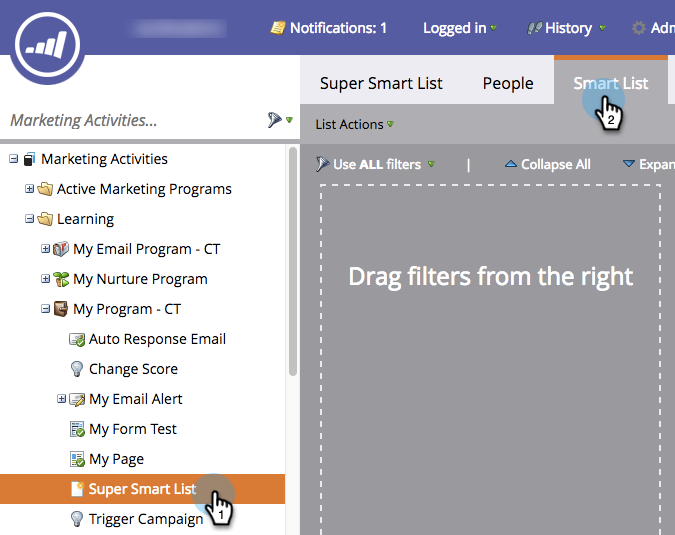

# 在智慧清單中使用清單成員{#use-members-of-list-in-a-smart-list}

>[!TIP]
>
>您可以使用[Import](/help/marketo/getting-started/quick-wins/import-a-list-of-people.md)或[Add to List flow step](/help/marketo/product-docs/core-marketo-concepts/smart-campaigns/flow-actions/add-to-list.md)將人員新增至清單。

使用此篩選器，您可以在智慧型清單規則中參照其他清單來提取成員。 這是方法。

1. 選擇智慧清單並按一下&#x200B;**智慧清單**&#x200B;頁籤。

   

1. 在右側濾鏡面板上，搜尋並拖曳清單成員&#x200B;**濾鏡至畫布。**

   

1. 按一下下拉清單或鍵入以搜索要包含在智慧清單中的清單。

   

   完成! 在此範例中，智慧型清單現在只會定位該清單的成員，並根據您包含的任何其他規則來評估這些成員。
