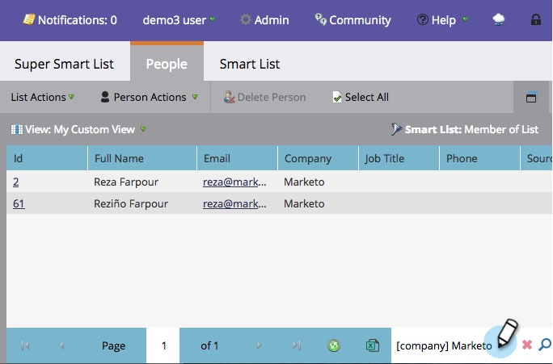

# 在清單或智慧清單中使用快速尋找 {#use-quick-find-in-a-list-or-smart-list}

使用快速尋找，從清單或智慧清單的結果中尋找人員。

1. 前往 **[!UICONTROL Marketing Activities]**。

   

1. 選取您要搜尋的智慧列示，然後按一下&#x200B;**[!UICONTROL People]**&#x200B;索引標籤。

   

## 使用個人資訊尋找人員 {#find-people-using-personal-info}

1. 在畫面底部的&#x200B;**[!UICONTROL Quick Find]**&#x200B;方塊中，輸入關鍵字（**個人姓名**、**電子郵件地址**&#x200B;或&#x200B;**職稱**）。

   

1. 按下Enter或按一下搜尋圖示，您即完成搜尋。

## 使用公司名稱尋找人員 {#find-people-using-a-company-name}

1. 若要尋找公司，請在[快速尋找]方塊中輸入`[company]`，然後輸入您要尋找之公司名稱的任何部分。

   

1. 按下Enter或按一下搜尋圖示，您即完成搜尋。
