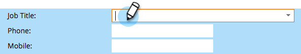

# 使用「人員詳細資訊」頁 {#using-the-person-detail-page}

人物詳細資訊頁面包含Marketo所瞭解的關於人的所有資訊。 可以直接從此頁編輯資料。

## 「訪問人員詳細資訊」頁 {#getting-to-person-detail-page}

有很多方法可以開放特定的人。 有些示例包括：

* 從 **資料庫**，可以在快速查找中搜索
* 任何智慧 **清單** 或清單
* **成員** 頁籤
* **查看市場活動成員** 在明智的活動中
* 部分 **報告**

     

1. 按兩下任何人或按一下左側的ID。

   

1. 這將開啟人員詳細資訊螢幕。

   

## 頁面組織 — Salesforce {#page-organization-salesforce}

人員資訊分為以下標籤：

| 頁籤 | 說明 |
|---|---|
| 資訊 | 聯繫資訊和有關人員的自定義欄位。 |
| 公司資訊 | 人員的公司資訊和地址。 |
| 機會資訊 | 從Salesforce同步的機會資訊。 |
| SFDC潛在客戶欄位 | 內置Salesforce欄位。 |
| SFDC自定義欄位 | 自定義Salesforce欄位。 |
| 活動日誌 | 所有與此人相關的活動。 |

## 頁面組織 — MicrosoftDynamics {#page-organization-microsoft-dynamics}

| 頁籤 | 說明 |
|---|---|
| 資訊 | 聯繫資訊和有關人員的自定義欄位。 |
| 公司資訊 | 人員的公司資訊和地址。 |
| 機會資訊 | 從Microsoft同步的機會資訊。 |
| Microsoft自定義域 | 自定義Microsoft欄位。 |
| Microsoft領隊 | 內置的Microsoft田。 |
| 活動日誌 | 所有與此人相關的活動。 |

>[!NOTE]
>
>您還可以看到Opportunity資訊 [通過API插入](https://developers.marketo.com/rest-api/lead-database/opportunities/) 未與CRM同步的實例。

## 編輯欄位 {#editing-a-field}

許多欄位都可編輯。 要更新人員資訊，請鍵入新值，然後按一下欄位外面以保存。

## MarketoCRM同步之前的預設欄位 {#marketo-default-fields-prior-to-crm-sync}

|  |  |  |  |  |
|---|---|---|---|---|
| 地址 | 年營業額 | 匿名IP | 帳單寄送地址 | 帳單寄送城市 |
| 帳單寄送國家 | 帳單郵遞區號 | 帳單寄送州 | 城市 | 公司名稱 |
| 國家 | 建立時間 | 出生日期 | 部門 | 請勿來電 |
| 不要調用原因 | 請勿來電的理由 | 電子郵件地址 | 電子郵件無效 | 電子郵件無效原因 |
| 外部公司ID | 外部銷售人員ID | 傳真號碼 | 名字 | 全名 |
| 行業 | 推斷城市 | 推斷公司 | 推斷國家 | 推斷都市區 |
| 推斷出的電話區號 | 推斷的郵遞區號 | 推斷的州區 | 是匿名的 | 是客戶 |
| 是合作夥伴 | 職稱 | 姓氏 | 評級 | 得分 |
| 人員來源 | 狀態 | 主要電話 | Marketo社會Facebook顯示名稱 | Marketo社會FacebookID |
| Marketo社會Facebook照片URL | Marketo社會Facebook個人資料URL | Marketo社會Facebook | Marketo社會Facebook引薦入學 | Marketo社Facebook轉述訪問 |
| Marketo社會性別 | Marketo社會上次推薦的註冊 | Marketo社交界人士最後一次訪問 | Marketo社會LinkedIn顯示名稱 | Marketo社會LinkedInID |
| Marketo社會LinkedIn照片URL | Marketo社會LinkedIn個人資料URL | Marketo社會LinkedIn | Marketo社會LinkedIn引薦入學 | Marketo社LinkedIn轉述訪問 |
| Marketo社會協同內容ID | Marketo社會總參考 | Marketo社會總參訪 | Marketo社會Twitter顯示名稱 | Marketo社會TwitterID |
| Marketo社會Twitter照片URL | Marketo社會Twitter個人資料URL | Marketo社會Twitter | Marketo社會Twitter引薦入學 | Marketo社Twitter轉述訪問 |
| 中間名 | 手機號碼 | 員工數 | 電話號碼 | 郵遞區號 |
| 優先順序 | 相對分數 | 職位 | 稱謂 | 標準產業分類（SIC）代碼 |
| 現場 | 州 | 退訂 | 退訂原因 | 更新時間 |
| 緊急 | 網站 |  |  |  |

>[!NOTE]
>
>某些欄位 _不_ 可編輯：
>
>* 活動日誌
>* 公司資訊
>* SFDC聯繫人的機會
>* 某些特定於Marketo的欄位，如建立日期和原始源類型。
>
>瞭解有關 [系統管理欄位](/help/marketo/product-docs/administration/field-management/understanding-system-managed-fields.md)。

>[!MORELIKETHIS]
>
>[為「人員詳細資訊」頁建立自定義頁籤](/help/marketo/product-docs/administration/settings/creating-a-custom-tab-for-the-person-detail-page.md)
