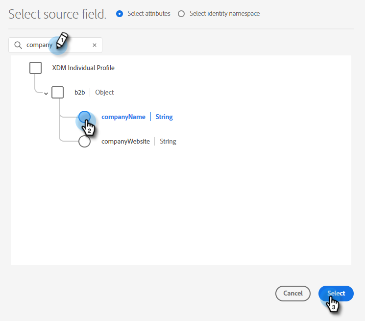

# 將Adobe Experience Platform區段推送至Marketo靜態清單 {#push-an-adobe-experience-platform-segment-to-a-marketo-static-list}

此功能可讓您以靜態清單的形式，將Adobe Experience Platform中的區段推送至Marketo Engage。

>[!PREREQUISITES]
>
>* [編輯API角色](/help/marketo/product-docs/administration/users-and-roles/create-delete-edit-and-change-a-user-role.md#edit-an-existing-role){target="_blank"}，確定它具有&#x200B;**讀寫人員**&#x200B;許可權（可在「存取API」下拉式清單下找到）。
>* 在Marketo中[建立API使用者](/help/marketo/product-docs/administration/users-and-roles/create-an-api-only-user.md){target="_blank"}。
>* 前往&#x200B;**[!UICONTROL Admin]** > **[!UICONTROL Launchpoint]**。 尋找您剛建立的角色名稱，然後按一下&#x200B;**[!UICONTROL View Details]**。 複製並儲存&#x200B;**[!UICONTROL Client ID]**&#x200B;和&#x200B;**[!UICONTROL Client Secret]**&#x200B;中的資訊，因為您可能在步驟7中需要它。
>* 在Marketo中建立靜態清單，或尋找並選取您已建立的清單。 您需要其ID。

1. 登入[Adobe Experience Platform](https://experience.adobe.com/){target="_blank"}。

   

1. 按一下格線圖示並選取&#x200B;**[!UICONTROL Experience Platform]**。

   

1. 在左側導覽中，按一下&#x200B;**[!UICONTROL Destinations]**。

   

1. 按一下「**[!UICONTROL Catalog]**」。

   

1. 找到Marketo Engage圖磚，然後按一下&#x200B;**[!UICONTROL Activate]**。

   

1. 按一下「**[!UICONTROL Configure New Destination]**」。

   

1. 在「帳戶型別」下，選取「現有帳戶」或「新帳戶」選項按鈕（在此範例中，我們選擇&#x200B;**[!UICONTROL Existing Account]**）。 按一下選取帳戶圖示。

   

   >[!NOTE]
   >
   >如果您選擇「新帳戶」，您可以前往「**[!UICONTROL Admin]** > **[!UICONTROL Munchkin]**」尋找您的Munchkin ID (登入後也是Marketo URL的一部分)。 使用者端ID/密碼：您應遵循本文最上方所述的先決條件。

1. 選擇目的地帳戶並按一下&#x200B;**[!UICONTROL Select]**。

   

1. 輸入目的地&#x200B;**[!UICONTROL Name]**&#x200B;和選用的描述。 按一下「建立人員」下拉式清單，然後選擇「比對現有的Marketo人員並在Marketo中建立缺少的人員」_或_「僅比對現有的Marketo人員」（在此範例中，我們選擇前者）。 您也必須選擇&#x200B;**[!UICONTROL Workspace]**。

   

   >[!NOTE]
   >
   >如果您選擇「[!UICONTROL Match Existing Marketo People Only]」，則只需對應電子郵件和/或ECID，因此您可以略過步驟13至16。

1. 本節為選用。 按一下&#x200B;**[!UICONTROL Create]**&#x200B;以略過。

   

1. 選取您建立的目的地並按一下&#x200B;**[!UICONTROL Next]**。

   

1. 選擇您要傳送至Marketo的區段，然後按一下&#x200B;**[!UICONTROL Next]**。

   

   >[!NOTE]
   >
   >如果您選擇多個區段，必須將每個區段對應至[!UICONTROL Segment Schedule]索引標籤中的指定靜態清單。

   >[!IMPORTANT]
   >
   >第一次將區段啟用至Marketo目的地後，回填在Marketo目的地啟用之前已存在於區段中的設定檔最多可能需要&#x200B;_24小時_。 此後，每當設定檔新增至區段時，都會立即新增至Marketo。

1. 按一下「**[!UICONTROL Add New Mapping]**」。

   

1. 按一下對應圖示。

   

1. 選擇您想要的屬性，然後按一下&#x200B;**[!UICONTROL Select]**。 在此範例中，我們會選擇名字、姓氏和電子郵件地址。

   

   >[!NOTE]
   >
   >您可以將屬性從Experience Platform對應至貴組織在Marketo Engage中可存取的任何屬性。 使用[Describe API要求](https://experienceleague.adobe.com/zh-hant/docs/marketo-developer/marketo/rest/lead-database/lead-database#describe){target="_blank"}來擷取貴組織有權存取的屬性欄位。

1. 再次按一下&#x200B;**[!UICONTROL Add New Mapping]**&#x200B;並重複步驟15兩次，選擇&#x200B;**[!UICONTROL lastName]**&#x200B;再選擇&#x200B;**[!UICONTROL companyName]**，以對應姓氏和公司名稱。

   

1. 現在要對映電子郵件地址。 再按一下&#x200B;**[!UICONTROL Add New Mapping]**。

   

1. 按一下對應圖示。

   

1. 按一下[選取身分名稱空間]選項按鈕，選擇&#x200B;**[!UICONTROL Email]**，然後按一下&#x200B;**[!UICONTROL Select]**。

   

   >[!IMPORTANT]
   >
   >從&#x200B;**[!UICONTROL Identity Namespace]**&#x200B;標籤對應電子郵件和/或ECID是最重要的事項，以確保人員在Marketo中相符。 對應電子郵件將確保最高符合率。

1. 現在該選擇來源欄位了。 針對電子郵件，按一下游標圖示。

   

1. 按一下[選取身分名稱空間]選項按鈕，尋找並選取&#x200B;**[!UICONTROL Email]**，然後按一下&#x200B;**[!UICONTROL Select]**。

   

1. 若要選擇「公司名稱」來源欄位，請按一下其列中的游標圖示。

   

1. 保留「選取屬性」選項按鈕為已核取。 搜尋「公司」並選取&#x200B;**[!UICONTROL companyName]**，然後按一下&#x200B;**[!UICONTROL Select]**。

   

1. 按一下每一個的游標圖示並重複步驟23兩次，選擇&#x200B;**[!UICONTROL lastName]**，然後選擇&#x200B;**[!UICONTROL firstName]**，以對應姓氏和名字的來源欄位。

   

1. 按一下「**[!UICONTROL Next]**」。

   

1. 檢閱您的變更並按一下&#x200B;**[!UICONTROL Finish]**。

   
