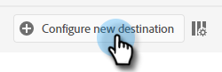
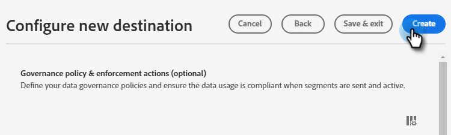
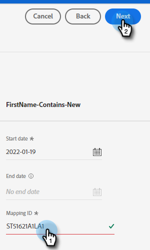

# 推送克隆 {#push-clone}

此功能允許您以靜態清單的形式將位於Adobe Experience Platform的段推送到Marketo。

>[!PREREQUISITES]
>
>* [建立API用戶](/help/marketo/product-docs/administration/users-and-roles/create-an-api-only-user.md) 在Marketo。
>* 然後，轉到 **管理** > **朗奇波因特**。 查找您剛建立的角色的名稱，然後按一下 **查看詳細資訊**。 複製並保存資訊 **客戶端ID** 和 **客戶端密碼**，因為您需要它。
>* 在Marketo，建立靜態清單，或查找並選擇已建立的清單。 你需要它的身份證。

1. 登錄到 [Adobe Experience Platform](https://experience.adobe.com/)。

   

1. 按一下網格表徵圖並選擇 **Experience Platform**。

   

1. 在左導航中，按一下 **目標**。

   

1. 按一下 **目錄**。

   

1. 查找Marketo Engage磁貼，然後按一下 **激活段**。

   

1. 按一下 **配置新目標**。

   

1. 在「帳戶類型」下，選擇「現有帳戶」或「新建帳戶」單選按鈕(在本例中，我們選擇 **現有帳戶**)。 按一下「選擇帳戶」表徵圖。

   

   >[!NOTE]
   >
   >如果您選擇「新帳戶」，則可以通過轉到 **管理** > **蒙奇金** (它也是登錄後的MarketoURL的一部分)。 客戶端ID/密碼您應從本文頂部的先決條件中獲得。

1. 選擇目標帳戶並按一下 **選擇**。

   

1. 輸入目標 **名稱** 和可選說明。 按一下「人員建立」下拉框並選擇「匹配現有Marketo人員並建立Marketo中的失蹤人員」 _或_ 「只匹配現有Marketo人。」 在這個例子中，我們選擇前者。

   

   >[!NOTE]
   >
   >如果選擇「僅匹配現有Marketo人員」，則只需映射電子郵件和/或ECID，因此您可以跳過步驟13-16。

1. 此部分是可選的。 按一下 **建立** 跳過。

   

1. 選擇您建立的目標，然後按一下 **下一個**。

   

1. 選擇要發送到Marketo的段，然後按一下 **下一個**。

   

   >[!NOTE]
   >
   >如果在此處選擇多個段，則必須將每個段映射到「段調度」頁籤中的指定靜態清單。

1. 按一下 **添加新映射**。

   

1. 按一下映射表徵圖。

   

1. 通過選擇映射名 **名字** 按一下 **選擇**。

   

1. 按一下以映射姓氏和公司名稱 **添加新映射** 重複步驟15兩次，選擇 **姓氏** 然後 **公司名稱**。

   

1. 現在是繪製電子郵件地址的時候了。 按一下 **添加新映射** 的雙曲餘切值。

   

1. 按一下映射表徵圖。

   

1. 按一下「選擇標識名稱空間」單選按鈕，選擇  **電子郵件**，然後按一下 **選擇**。

   

   >[!IMPORTANT]
   >
   >從映射 **標識命名空間** tab是確保在Marketo相配的最重要的事情。 映射電子郵件將確保最高匹配率。

1. 現在是時候選擇源欄位了。 對於電子郵件，按一下游標表徵圖。

   

1. 按一下「選擇標識名稱空間」單選按鈕，查找並選擇 **電子郵件**，然後按一下 **選擇**。

   

1. 要選擇「公司名稱」源欄位，請按一下其行中的游標表徵圖。

   

1. 選中「選擇屬性」單選按鈕。 搜索「公司」並選擇 **公司名稱**，然後按一下 **選擇**。

   

1. 通過按一下每個名稱的游標表徵圖並重複步驟23，選擇 **姓氏** 然後 **名字**。

   

1. 按一下 **下一個**。

   

1. 你現在需要你的名單ID。 按一下瀏覽器中開啟Marketo靜態清單的頁籤（或開啟新頁籤並選擇所需的靜態清單）。

   

   >[!NOTE]
   >
   >為獲得最佳結果，請使用空Marketo Engage清單。

1. 突出顯示並複製URL末尾的清單ID。

   

1. 貼上剛複製的ID（映射ID），然後按一下 **下一個**。

   

1. 按一下 **完成**。

   
