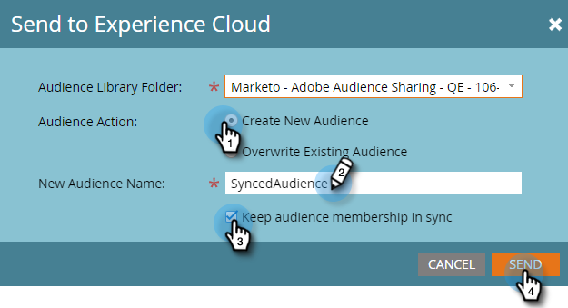

# 將清單發送到Adobe Experience Cloud{#send-a-list-to-adobe-experience-cloud}

>[!NOTE]
>
>Marketo例項的HIPAA適用部署無法使用此功能。

>[!PREREQUISITES]
>
>[設定Adobe Experience Cloud觀眾分享](/help/marketo/product-docs/core-marketo-concepts/miscellaneous/set-up-adobe-experience-cloud-audience-sharing.md)

## 支援的目標應用程式{#supported-destination-applications}

* Adobe Advertising Cloud
* Adobe Analytics(**only**&#x200B;如果您擁有Adobe Audience Manager授權)
* Adobe Audience Manager
* Adobe Experience Manager
* Adobe即時客戶資料平台
* Adobe Target

## 如何發送靜態清單{#how-to-send-a-static-list}

靜態清單就是靜態的。 除非您手動進行變更，否則不會對Adobe Experience Cloud的清單進行任何變更。

1. 在Marketo中，尋找並選取您要匯出的清單。

   

1. 按一下&#x200B;**列出操作**&#x200B;下拉式清單並選擇&#x200B;**發送到Experience Cloud**。

   

1. 按一下&#x200B;**Audience Manager資料夾**&#x200B;下拉式清單，然後在Experience Cloud中選擇所需的目標資料夾。

   

1. 選擇要建立新對象或覆寫現有對象（在此範例中，我們要建立新對象）。 輸入新的對象名稱，然後按一下「傳送&#x200B;**」。**

   

1. 按一下&#x200B;**確定**。

   

   >[!NOTE]
   >
   >觀眾會籍最多需要6-8小時，才能完整填入Adobe。

## 如何傳送同步清單{#how-to-send-a-synced-list}

同步清單表示，只要您在Marketo中更新清單，這項變更就會自動同步至Adobe Experience Cloud的觀眾。

1. 在Marketo中，尋找並選取您要同步的清單。

   

1. 按一下&#x200B;**列出操作**&#x200B;下拉式清單並選擇&#x200B;**發送到Experience Cloud**。

   

1. 按一下「**觀眾程式庫資料夾**」下拉式清單，並在Experience Cloud中選取所要的目標資料夾。

   

1. 選擇要建立新對象或覆寫現有對象（在此範例中，我們要建立新對象）。 輸入新的對象名稱，勾選「保持對象成員資格同步」方塊，然後按一下「傳送」。********

   

1. 按一下&#x200B;**確定**。

   

## 如何停止清單同步{#how-to-stop-a-list-sync}

您可以隨時停止同步清單。

1. 在Marketo中，尋找並選取您要停止同步的清單。

   

1. 按一下&#x200B;**列出操作**&#x200B;下拉清單並選擇&#x200B;**停止清單同步**。

   

1. 選取您要停止同步的對象，然後按一下「停止」。****

   

1. 按一下&#x200B;**Stop**&#x200B;確認。

   

## 注意事項{#things-to-note}

**與Adobe Analytics分享**

對於同時擁有Adobe Audience Manager和Adobe Analytics的客戶，此整合可讓受眾從Marketing分享至您的Adobe Analytics報表套裝，但是，在Adobe Audience Manager還需要執行一些額外的設定步驟，以啟用此功能。 請參閱Adobe Audience Manager的檔案，以取得如何設定此設定的詳細資訊：[https://docs.adobe.com/content/help/en/analytics/integration/audience-analytics/mc-audiences-aam.html](https://docs.adobe.com/content/help/en/analytics/integration/audience-analytics/mc-audiences-aam.html)。

**Adobe Audience Manager客戶的特徵使用**

當您在Marketo中起始清單匯出時，您會注意到您的Adobe Audience Manager實例中反映的下列變更：

* 對於匯出清單中的所有Lead,Marketo會使用Leads的雜湊電子郵件作為跨裝置識別碼來編寫特徵。 特徵的名稱將符合您在匯出期間指定的目標對象名稱。
* 對於Marketo已設法符合匯出清單中銷售機會的所有ECID,Marketo會使用ECID裝置識別碼來編寫特徵。 特徵的名稱將符合您在匯出期間指定的目標對象名稱。
* Marketo也會在您的Audience Manager例項中，以ECID特性作為唯一的分段標準來建立區段。 區段的名稱將符合您在匯出期間指定的目標對象名稱。

## 常見問答{#faq}

**為什麼Marketo中的清單大小與Adobe中的清單大小不同？**

在Hood中，對象整合的運作方式是將Marketo Munchkin Cookie與對應的AdobeECID Cookie同步。 Marketo只能分享Marketo為之同步ECID之潛在客源的會籍資料。 為獲得最佳結果，建議您在所有想要追蹤以用於行銷目的的頁面上，同時載入Adobe的munchkin.js追蹤指令碼及其visitor.js追蹤代碼。

**Cookie如何同步？**

當您的Marketo訂閱啟用Cookie同步時，Marketo的munchkin.js會嘗試擷取並儲存您在整合設定期間指定之AdobeIMS組織的AdobeECID，並將這些ECID與對應的Marketo Cookie識別碼相符。 這可讓Marketo的匿名使用者個人檔案更豐富地使用AdobeECID。

需要進一步步驟，將匿名用戶配置檔案與使用純文字檔案電子郵件標識的銷售線索配置檔案關聯。 這裡描述的[是如何運作的](/help/marketo/product-docs/reporting/basic-reporting/report-activity/tracking-anonymous-activity-and-people.md)。

**共用哪些資訊？**

此整合只會分享從Marketo到Adobe的清單會籍資訊（例如，瞭解Lead X是清單Y的成員）。 不會透過此整合將其他「銷售機會屬性」共用給Adobe。
