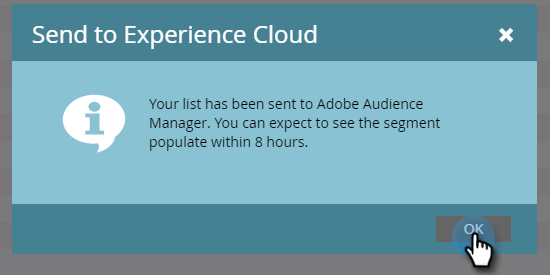

# 將清單傳送至Adobe Experience Cloud {#send-a-list-to-adobe-experience-cloud}

>[!NOTE]
>
>Marketo實例的HIPAA就緒部署無法使用此功能。

>[!PREREQUISITES]
[設定Adobe Experience Cloud受眾共用](/help/marketo/product-docs/core-marketo-concepts/miscellaneous/set-up-adobe-experience-cloud-audience-sharing.md)>
>

## 支援的目標應用程式{#supported-destination-applications}

* Adobe Advertising Cloud
* Adobe Analytics(**僅**&#x200B;如果您擁有Adobe Audience Manager授權)
* Adobe Audience Manager
* Adobe Experience Manager
* Adobe即時客戶資料平台
* Adobe Target

## 如何傳送靜態清單{#how-to-send-a-static-list}

靜態的清單就是那樣，靜態的。 除非您手動進行，否則Adobe Experience Cloud中的清單不會變更。

1. 在Marketo中，尋找並選取您要匯出的清單。

   

1. 按一下&#x200B;**List Actions**&#x200B;下拉式清單，然後選取&#x200B;**Send to Experience Cloud**。

   

1. 按一下&#x200B;**Audience Manager資料夾**&#x200B;下拉式清單，並在Experience Cloud中選取所需的目的地資料夾。

   

1. 選擇要建立新對象或覆寫現有對象（在此範例中，我們要建立新對象）。 輸入新對象名稱，然後按一下&#x200B;**Send**。

   

1. 按一下&#x200B;**確定**。

   

   >[!NOTE]
   對象會籍最多可能需要6到8小時，才能完全填入Adobe。

## 如何傳送同步清單{#how-to-send-a-synced-list}

同步清單表示您每次在Marketo中更新清單時，該變更會自動同步至Adobe Experience Cloud中的對象。

1. 在Marketo中，尋找並選取您要同步的清單。

   

1. 按一下&#x200B;**List Actions**&#x200B;下拉式清單，然後選取&#x200B;**Send to Experience Cloud**。

   

1. 按一下&#x200B;**受眾程式庫資料夾**&#x200B;下拉式清單，並在Experience Cloud中選取所需的目的地資料夾。

   

1. 選擇要建立新對象或覆寫現有對象（在此範例中，我們要建立新對象）。 輸入新對象名稱，勾選「在同步中保留對象成員資格」方塊，然後按一下「**傳送**」。****

   

1. 按一下&#x200B;**確定**。

   

## 如何停止清單同步{#how-to-stop-a-list-sync}

您可以隨時停止同步清單。

1. 在Marketo中，尋找並選取您要停止同步的清單。

   

1. 按一下&#x200B;**List Actions**&#x200B;下拉式清單，然後選擇&#x200B;**Stop List Sync**。

   

1. 選取您要停止同步的對象，然後按一下&#x200B;**Stop**。

   

1. 按一下&#x200B;**Stop**&#x200B;以確認。

   

## 注意事項{#things-to-note}

**共用至Adobe Analytics**

對於同時擁有Adobe Audience Manager和Adobe Analytics的客戶，此整合可讓對象從Marketo共用至您的Adobe Analytics報表套裝，不過Adobe Audience Manager中需執行一些額外設定步驟才能啟用此功能。 請參閱Adobe Audience Manager的檔案，以取得如何設定此設定的詳細資訊：[https://experienceleague.adobe.com/docs/analytics/integration/audience-analytics/mc-audiences-aam.html](https://experienceleague.adobe.com/docs/analytics/integration/audience-analytics/mc-audiences-aam.html)。

**Adobe Audience Manager客戶的特徵使用量**

在Marketo中起始匯出清單時，您會注意到Adobe Audience Manager例項中反映的下列變更：

* 對於匯出清單中的所有Lead,Marketo會使用Lead的雜湊電子郵件作為跨裝置識別碼來撰寫特徵。 特徵名稱會與您在匯出期間指定的目的地對象名稱相符。
* 對於Marketo已設法與匯出清單中的銷售機會相符的所有ECID,Marketo會使用ECID裝置識別碼撰寫特徵。 特徵名稱會與您在匯出期間指定的目的地對象名稱相符。
* Marketo也會以ECID特徵作為唯一的分段標準，在您的Audience Manager例項中建立區段。 區段的名稱會符合您在匯出期間指定的目的地對象名稱。

## 常見問題集 {#faq}

**Marketo中的清單大小為何與Adobe中的不同？**

在外罩下方，將Marketo Munchkin Cookie與對應的AdobeECID Cookie同步，即可運作對象整合。 Marketo只能共用Marketo已同步ECID之銷售機會的成員資格資料。 為了獲得最佳結果，建議您針對行銷目的，在您有興趣追蹤的所有頁面上，同時載入Marketo的munchkin.js追蹤指令碼與Adobe的visitor.js追蹤程式碼。

**Cookie同步如何運作？**

當您的Marketo訂閱啟用Cookie同步時，Marketo的munchkin.js會嘗試擷取並儲存您在整合設定期間指定之AdobeIMS組織的AdobeECID，並將這些ECID與對應的Marketo Cookie識別碼相符。 這可讓Marketo的匿名使用者設定檔更加豐富AdobeECID。

還需要執行進一步步驟來將匿名用戶配置檔案與銷售機會配置檔案關聯，銷售機會配置檔案是使用純文字電子郵件標識的。 [這裡](/help/marketo/product-docs/reporting/basic-reporting/report-activity/tracking-anonymous-activity-and-people.md)說明了其運作方式。

**共用哪些資訊？**

此整合僅共用從Marketo到Adobe的清單成員資訊（例如，了解銷售機會X是清單Y的成員）。 不會透過此整合與Adobe共用其他銷售機會屬性。
