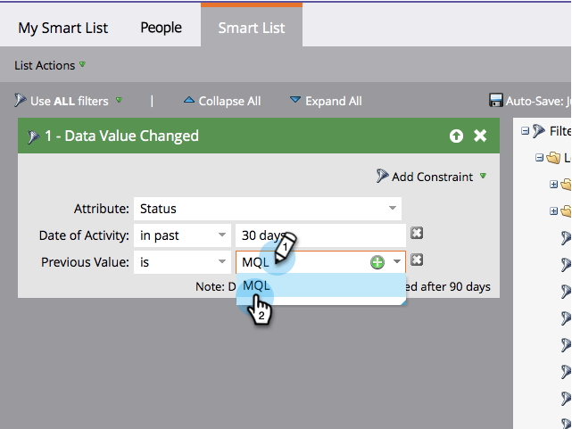

# 新增限制至智慧清單篩選器 {#add-a-constraint-to-a-smart-list-filter}

建立智慧列示時，有些濾鏡具有稱為「限制」的進階選項。 這些是可新增至篩選器和觸發器的額外條件，有助於進一步縮小搜尋範圍。

在此範例中，我們將一些限制新增至 **[資料值已變更](/help/marketo/product-docs/core-marketo-concepts/smart-campaigns/flow-actions/change-data-value.md)** 篩選以尋找狀態從MQL變更為SQL的人員。

>[!PREREQUISITES]
>
>* [建立智慧清單](/help/marketo/product-docs/core-marketo-concepts/smart-lists-and-static-lists/creating-a-smart-list/create-a-smart-list.md)
>* [在智慧清單中使用「資料值已變更」篩選器](/help/marketo/product-docs/core-marketo-concepts/smart-lists-and-static-lists/using-smart-lists/use-the-data-value-changed-filter-in-a-smart-list.md)
>

1. 前往 **行銷活動**.

   

1. 選取含有您即將新增限制之篩選器的智慧清單，然後按一下 **智慧清單** 標籤。

   

1. 在 **新增限制**，選取 **上一個值**.

   

1. 輸入 **上一個值**. 在此範例中，我們使用MQL。

   

1. 在 **新增限制**，選取 **新值**.

   

1. 輸入 **新值**. 在此範例中，我們使用SQL。

   

1. 做得很好！ 按一下 **人員** tab鍵檢視所有擁有 **狀態** 變更自 **MQL** 至 **SQL** 在過去30天內。
