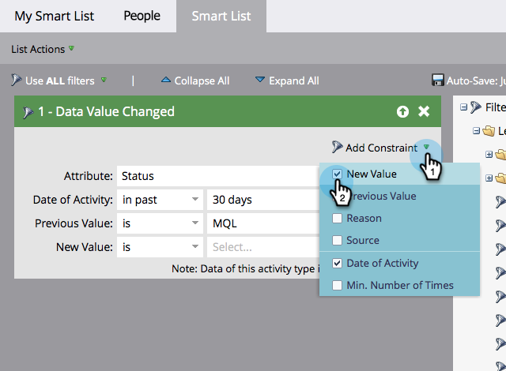

# 新增限制至智慧清單篩選器 {#add-a-constraint-to-a-smart-list-filter}

建立智慧列示時，有些篩選器會具有稱為「限制」的進階選項。 這些是可新增至篩選器和觸發器的額外條件，有助於進一步縮小搜尋範圍。

在此範例中，我們將一些限制新增至&#x200B;**[資料值已變更](/help/marketo/product-docs/core-marketo-concepts/smart-campaigns/flow-actions/change-data-value.md){target="_blank"}**&#x200B;篩選器，以尋找狀態從MQL變更為SQL的人員。

>[!PREREQUISITES]
>
>* [建立智慧清單](/help/marketo/product-docs/core-marketo-concepts/smart-lists-and-static-lists/creating-a-smart-list/create-a-smart-list.md){target="_blank"}
>* [在智慧清單中使用「資料值已變更」篩選器](/help/marketo/product-docs/core-marketo-concepts/smart-lists-and-static-lists/using-smart-lists/use-the-data-value-changed-filter-in-a-smart-list.md){target="_blank"}

1. 移至&#x200B;**[!UICONTROL 行銷活動]**。

   

1. 選取含有您即將新增限制之篩選器的智慧清單，然後按一下&#x200B;**[!UICONTROL 智慧清單]**&#x200B;索引標籤。

   

1. 在&#x200B;**[!UICONTROL 新增限制]**&#x200B;下，選取&#x200B;**[!UICONTROL 先前的值]**。

   

1. 輸入&#x200B;**[!UICONTROL 先前的值]**。 在此範例中，我們使用MQL。

   

1. 在&#x200B;**[!UICONTROL 新增限制]**&#x200B;下，選取&#x200B;**[!UICONTROL 新值]**。

   

1. 輸入新值。 在此範例中，我們使用SQL。

   

1. 做得很好！ 按一下「**[!UICONTROL 人員]**」標籤，檢視過去30天內狀態從「MQL」變更為「SQL」的所有人員。
