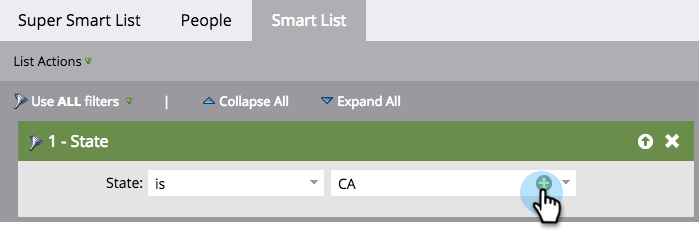

# 新增多個值至智慧清單篩選器 {#add-multiple-values-to-a-smart-list-filter}

>[!PREREQUISITES]
>
>* [建立智慧清單](/help/marketo/product-docs/core-marketo-concepts/smart-lists-and-static-lists/creating-a-smart-list/create-a-smart-list.md){target="_blank"}
>* [尋找並新增篩選器至智慧清單](/help/marketo/product-docs/core-marketo-concepts/smart-lists-and-static-lists/creating-a-smart-list/find-and-add-filters-to-a-smart-list.md){target="_blank"}

假設您想尋找加州的所有人，但您可能同時將「California」和「CA」儲存在資料庫中。 若要包含所有適用人員，您可以使用兩個[!UICONTROL State]篩選器，但使用其中一個篩選器會比較容易。

1. 移至&#x200B;**[!UICONTROL Marketing Activities]**。

   

1. 尋找並選取智慧列示，然後按一下&#x200B;**[!UICONTROL Smart List]**&#x200B;標籤。

   

1. 按一下篩選器上的&#x200B;**+**。

   

1. 您可以從左邊選擇值，或直接在右邊輸入值，然後按一下&#x200B;**[!UICONTROL OK]**。

   

快速工作！

>[!MORELIKETHIS]
>
>* [新增限制至智慧清單篩選器](/help/marketo/product-docs/core-marketo-concepts/smart-lists-and-static-lists/using-smart-lists/add-a-constraint-to-a-smart-list-filter.md){target="_blank"}
>* [在智慧清單中使用進階濾鏡](/help/marketo/product-docs/core-marketo-concepts/smart-lists-and-static-lists/using-smart-lists/using-advanced-smart-list-rule-logic.md){target="_blank"}
