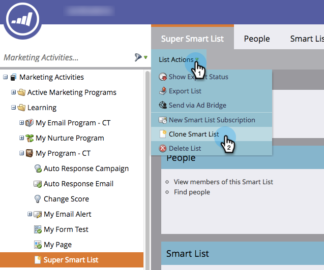

# 複製清單或智慧清單{#clone-a-list-or-smart-list}

與其從頭開始建立智慧型清單，不如克隆類似清單並進行變更，以節省一些時間。 這是方法。

1. 前往&#x200B;**行銷活動**。

   

1. 選擇要克隆的智慧清單。

   

1. 在「**列出操作**」下，按一下「複製智慧清單&#x200B;**」。**

   

1. 輸入&#x200B;**名稱**，然後按一下&#x200B;**克隆**。

   

幹得好！ 您也可以以相同的方式複製規則清單。
