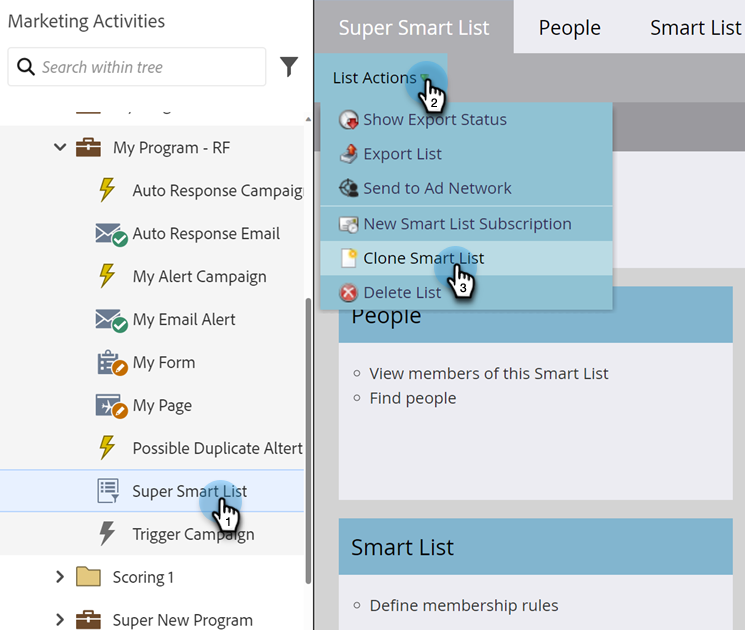

# 原地複製清單或智慧清單 {#clone-a-list-or-smart-list}

您不必從頭開始建立「智慧列示」，只要複製類似的清單並進行變更即可節省時間。 方法如下。

1. 移至&#x200B;**[!UICONTROL Marketing Activities]**。

   

1. 選取您要複製的智慧清單。 在&#x200B;**[!UICONTROL List Actions]**&#x200B;底下，按一下&#x200B;**[!UICONTROL Clone Smart List]**。

   

1. 輸入&#x200B;**[!UICONTROL Name]**&#x200B;並按一下&#x200B;**[!UICONTROL Clone]**。

   

做得好！ 您也可以以相同方式複製一般清單。
