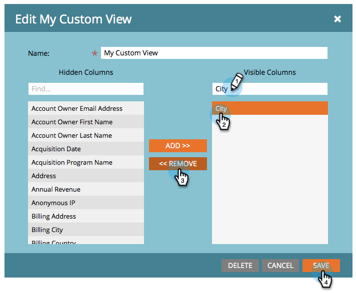

# 建立和變更清單和智慧清單的檢視 {#create-and-change-views-for-lists-and-smart-list}

「智慧列示」會顯示預設的欄集合。 您知道您可以編輯這些欄以符合您心靈的內容嗎？ 方法如下。

## 建立檢視 {#create-a-view}

1. 前往清單或智慧清單，按一下&#x200B;**[!UICONTROL 人員]**&#x200B;標籤，然後按一下&#x200B;**[!UICONTROL 檢視]**&#x200B;下拉式清單下的&#x200B;**[!UICONTROL 建立檢視]**。

   

1. 為檢視命名，並尋找要新增或移除的欄。

   

1. 新增/移除您想要的資料行，然後按一下[建立]。****

   

>[!TIP]
>
>若要快速搜尋，請使用&#x200B;**尋找**&#x200B;方塊。

## 切換檢視 {#switch-views}

1. 按一下&#x200B;**[!UICONTROL 檢視]**&#x200B;下拉式清單，然後選取您要的檢視。 視需要在檢視之間來回切換。

   

>[!NOTE]
>
> 除了預設檢視之外，您必須先建立第二個檢視，才能切換檢視。

## 編輯檢視 {#edit-a-view}

1. 確定已在&#x200B;**[!UICONTROL 檢視]**&#x200B;下拉式清單中選取您要編輯的檢視。

   

1. 按一下&#x200B;**[!UICONTROL 編輯]**&#x200B;選項。

   

1. 進行您想要的變更，然後按一下[儲存]。****

   

## 刪除檢視 {#delete-a-view}

1. 選取您要從&#x200B;**[!UICONTROL 檢視]**&#x200B;下拉式清單刪除之檢視的&#x200B;**[!UICONTROL 編輯]**&#x200B;選項。

   

1. 按一下&#x200B;**[!UICONTROL 刪除]**。

   

只有您才能在「檢視」下拉式清單中看到您建立的自訂檢視，因此請告訴您的朋友他們需要建立自己的檢視！

>[!MORELIKETHIS]
>
>* [使用內建/系統智慧清單](/help/marketo/product-docs/core-marketo-concepts/smart-lists-and-static-lists/using-smart-lists/use-built-in-system-smart-lists.md){target="_blank"}
>* [建立智慧清單](/help/marketo/product-docs/core-marketo-concepts/smart-lists-and-static-lists/creating-a-smart-list/create-a-smart-list.md){target="_blank"}
