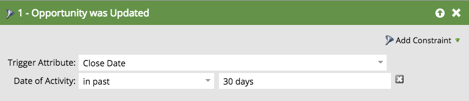

# 機會篩選器和觸發程式 {#opportunity-filters-and-triggers}

機會篩選器和觸發器可讓您從[!DNL Salesforce]追蹤機會事件。 與其他篩選器和觸發程式相比，這些功能稍有不同。

## 機會篩選器 {#opportunity-filters}

機會篩選器可讓您深入瞭解具有機會的Salesforce潛在客戶。 編輯「智慧列示」時，您可以在「浮動視窗」的「機會」資料夾中找到它們。 有幾種口味。

* 選件數目
* 總商機金額
* 總商機預期收入
* 有機會
* 機會已新增
* 機會已移除
* 機會已更新

如果您正在尋找您的Opportunity欄位（自訂或標準），請使用&#x200B;**Has Opportunity**&#x200B;篩選器或&#x200B;**Opportunity為`[Added/Removed/Updated]`**&#x200B;篩選器或觸發器。

**商機數目、總商機金額、總商機預期收入**

透過這些篩選，您可以根據所有商機的總數、金額或預期收入來尋找銷售機會。

**Has Opportunity （已新增至商機）已從商機中移除**

如果您要根據條件組合尋找擁有商機的潛在客戶，請使用&#x200B;**Has Opportunity**、**已新增至Opportunity**，或&#x200B;**已從商機**&#x200B;篩選器中移除。 他們會告訴你：

* **有機會**：如果此潛在客戶目前有任何相符的機會
* **已新增至商機**：如果此潛在客戶已新增至相符商機
* **已從商機移除**：如果此潛在客戶已從相符商機中移除

將搜尋條件新增為篩選器上的&#x200B;**限制**。 這些限制包括您的機會標準與自訂欄位：

例如，假設您想尋找潛在客戶具有至少$5,000美元的未完成機會。 拖曳至&#x200B;**Has Opportunity**&#x200B;篩選器並使用&#x200B;**Is Closed**&#x200B;和&#x200B;**Amount**&#x200B;限制：

>[!NOTE]
>
>當您使用多個機會篩選器時，您可能會收到不正確的答案。 如果您使用兩個Opportunity篩選條件建立上述範例，您會得到潛在客戶清單，這些潛在客戶擁有任何至少$5,000的銷售機會以及任何已結束的銷售機會，即使這些是個別的銷售機會。

**商機已更新**

**機會已更新**&#x200B;篩選器會在特定機會欄位已更新時尋找任何機會。 挑選要用「觸發屬性」下拉式清單檢查的欄位，然後使用限制來縮小變更集。

例如，此篩選器會顯示過去30天內有結束日期變更的所有潛在客戶：

## 機會觸發程式 {#opportunity-triggers}

下列機會觸發器可供使用。 它們的運作方式與其對應的篩選器（先前所述）相同，唯一例外是它們可以在事件發生時立即觸發行銷活動：

* 機會已更新
* 新增至商機
* 已從機會移除

例如，您可以使用此智慧清單來觸發將任何銷售機會新增至任何商機。 在流量中，您可以將受眾新增至行銷活動暫停清單或傳送目標電子郵件給受眾。

若要觸發您的機會自訂欄位，請使用&#x200B;**Opportunity is Updated**&#x200B;觸發器，並在下拉式清單中選取欄位：

