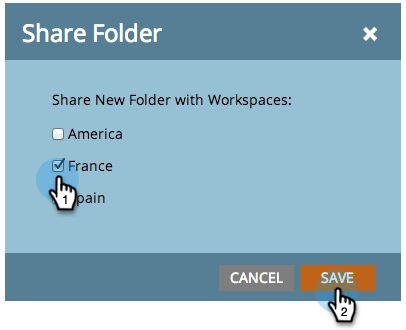

# 跨工作區參考清單或智慧清單 {#reference-a-list-or-smart-list-across-workspaces}

清單和智慧列示可在工作區之間共用和參考，以方便從資料庫重複使用。

>[!NOTE]
>
>適用人員分割規則(工作區中的智慧列示和靜態清單只會顯示同時是清單成員的人員 *和* 目前工作區的成員)。

## 共用清單或智慧清單  {#share-a-list-or-smart-list}

1. 前往 **資料庫**.

   

1. 以滑鼠右鍵按一下行銷活動資料夾。 選取 **新增資料夾**.

   >[!NOTE]
   >
   >資產若巢狀內嵌於資料夾，只能跨工作區共用。

   

1. 將您要共用的清單或智慧清單拖放至新資料夾。

   

1. 按一下右鍵 **新增資料夾** 並選取 **共用資料夾**.

   

1. 選擇 **工作區** 以與共用。 選取 **儲存**.

   

   棒極了！ 此清單現在可在兩個工作區中使用。

   >[!NOTE]
   >
   >在行銷活動中，您只能共用頂層資料夾。 在資料庫中，您可以共用頂層資料夾以及下一層。
