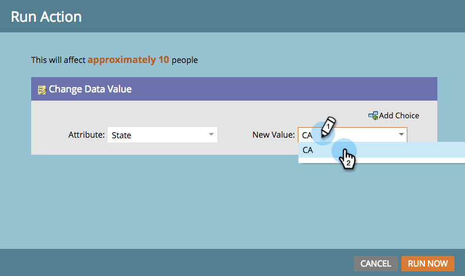

# 從智慧清單執行單一流程步驟 {#run-a-single-flow-step-from-a-smart-list}

如果您只想執行一次性的流量步驟，您可以在智慧清單中使用單一流量步驟，而非建立整個智慧行銷活動。

>[!PREREQUISITES]
>
>[建立智慧清單](/help/marketo/product-docs/core-marketo-concepts/smart-lists-and-static-lists/creating-a-smart-list/create-a-smart-list.md)

1. 前往 **行銷活動**.

   

1. 選取清單或包含人員的智慧清單，然後前往 **人員** 標籤。

   

   >[!TIP]
   >
   >靜態清單和智慧清單都有此功能。

1. 按一下 **全選**. 您也可以使用 **Ctrl/Cmd** 並按一下，以手動選取一些記錄。

   

   >[!NOTE]
   >
   >如果結果跨越多個頁面，請按一下 **全選** 將會選取所有頁面上的所有人員。

1. 在 **個人** **動作**，選取您選取的流程步驟。 在此範例中，我們將使用 [變更資料值](/help/marketo/product-docs/core-marketo-concepts/smart-campaigns/flow-actions/change-data-value.md).

   

1. 尋找並選取 **屬性**. 在此範例中，我們將接受所有擁有州「加州」的人，並將其變更為「CA」。

   

1. 輸入新值. 按一下 **立即執行**.

   

1. 如果您要變更大量人員的資料值，您可能需要輸入數字以確認變更。 按一下 **大膽試一試**.

   

做得棒極了！ 您會在右上角看到單一流程步驟的狀態。

完成後，請重新整理清單，您就會看到更新的資訊。
