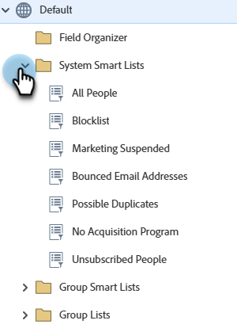

# 使用內建的系統智慧清單 {#use-built-in-system-smart-lists}

Marketo Engage有內建的智慧清單，可用於常見的分段工作。

1. 移至&#x200B;**[!UICONTROL Database]**。

   

1. 開啟&#x200B;**[!UICONTROL System Smart Lists]**&#x200B;資料夾以顯示集合。

   

1. 若要檢視範例：選取&#x200B;**[!UICONTROL All People]**，然後按一下&#x200B;**[!UICONTROL People]**&#x200B;索引標籤。

   

   >[!NOTE]
   >
   >系統智慧列示中的篩選器不需要套用至每個智慧列示/行銷活動。 系統會自動辨識它們的內容。

內建智慧清單的功能摘要如下：

<table><thead>
  <tr>
    <th>清單名稱</th>
    <th>說明</th>
  </tr></thead>
<tbody>
  <tr>
    <td>所有人員</td>
    <td>Marketo資料庫中的所有人員</td>
  </tr>
  <tr>
    <td>取消訂閱的人員</td>
    <td>這些人員只能收到操作電子郵件；這通常由人員自己控制。</td>
  </tr>
  <tr>
    <td>行銷活動暫停</td>
    <td>這些人員只能收到操作電子郵件；這通常由您（行銷人員）控制。</td>
  </tr>
  <tr>
    <td>封鎖清單</td>
    <td>這些人完全不會收到任何電子郵件。</td>
  </tr>
  <tr>
    <td>退回的電子郵件地址</td>
    <td>具有無法傳遞的電子郵件地址或拒絕您電子郵件的人員。</td>
  </tr>
  <tr>
    <td>可能的複製</td>
    <td>Marketo資料庫中可能重複的人員。</td>
  </tr>
</tbody>
</table>

>[!NOTE]
>
>無法刪除系統智慧清單。 除了「可能的重複專案」清單以外，也無法對其進行編輯。

>[!MORELIKETHIS]
>
>[建立智慧清單](/help/marketo/product-docs/core-marketo-concepts/smart-lists-and-static-lists/creating-a-smart-list/create-a-smart-list.md){target="_blank"}
