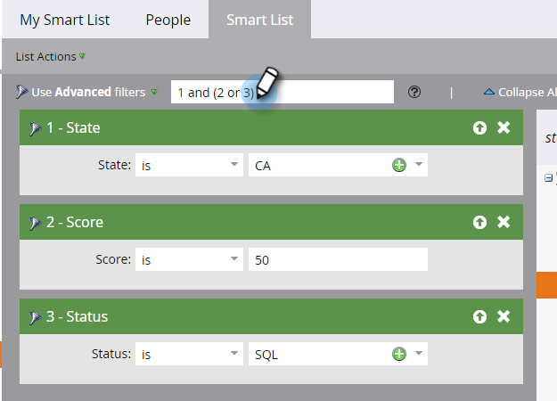

# 使用進階智慧清單規則邏輯 {#using-advanced-smart-list-rule-logic}

您可以將「智慧列示」規則邏輯套用至智慧列示內的多個篩選器，以找到您所需的確切人員。 方法如下。

>[!PREREQUISITES]
>
>* [尋找並新增篩選器至智慧清單](/help/marketo/product-docs/core-marketo-concepts/smart-lists-and-static-lists/creating-a-smart-list/find-and-add-filters-to-a-smart-list.md){target="_blank"}
>* [定義智慧清單篩選器](/help/marketo/product-docs/core-marketo-concepts/smart-lists-and-static-lists/creating-a-smart-list/define-smart-list-filters.md){target="_blank"}

>[!NOTE]
>
>進階篩選器邏輯僅適用於「智慧清單」中有三個或更多篩選器的情況。

## 將邏輯新增至智慧清單 {#add-logic-to-a-smart-list}

依預設，您的智慧清單會尋找符合&#x200B;**[!UICONTROL ALL]**&#x200B;篩選器（篩選器1 _和_ 2 _和_ 3）的人員。 您可以變更規則邏輯，以尋找符合已定義篩選器&#x200B;**[!UICONTROL ANY]**&#x200B;的人員（篩選器1 _或_ 2 _或_ 3），或使用進階篩選器（篩選器1 _和_ 2 _或_ 3）。

在此範例中，假設您想要尋找加州得分至少為50分&#x200B;_或_&#x200B;且狀態為「符合銷售資格」的人&#x200B;_和_。

1. 從下拉式清單中選取&#x200B;**[!UICONTROL 使用進階篩選器]**。

   

   >[!NOTE]
   >
   >使用&#x200B;**[!UICONTROL 進階]**&#x200B;篩選器可減少使用「智慧列示」篩選器的成員來建立「智慧列示」的需求。 這有助於最佳化效能。

1. **[!UICONTROL 進階篩選器]**&#x200B;文字方塊會顯示「與」作為所有篩選器之間的預設值。

   

1. 在「2和3」周圍鍵入一對括弧。

   

   >[!CAUTION]
   >
   >輸入規則邏輯時，必須在「or」前使用「and」。

1. 將「2 and 3」之間的「and」變更為「or」。

   

## 混合「And」和「Or」時使用括弧 {#use-parentheses-when-mixing-and-and-or}

混合「and」和「or」邏輯需要括弧來清楚表示您的意圖。

## 視需要使用巢狀括弧括住四個或更多篩選器 {#use-nested-parentheses-for-four-or-more-filters-if-needed}

根據您的意圖，在使用四個或更多篩選器時，您可能需要新增巢狀括弧。

>[!TIP]
>
>如果輸入無效的規則，規則下方會顯示一條紅線。 捲動文字以檢視相關的錯誤訊息。
