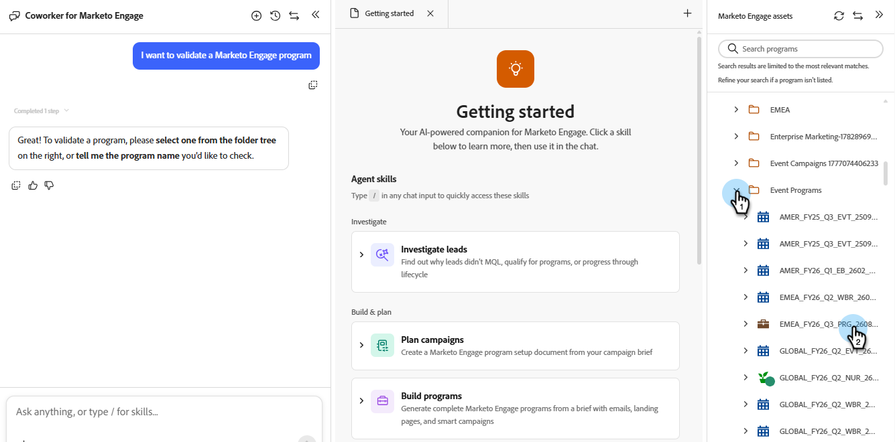

# 驗證程式 {#validate-programs}

稽核您的方案，以獲得所有元件（例如電子郵件、登陸頁面、行銷活動等）的最佳實務。

## 使用方式 {#how-to-use}

1. 在「我的Marketo」中，按一下「適用於Marketo Engage的&#x200B;**CX Enterprise Coworker」**&#x200B;圖磚。

   

1. 在提示視窗中輸入「I want to validate a Marketo Engage program」。

   

1. 在右窗格中選取您要驗證的程式。

   {width="800" zoomable="yes"}

   所選方案的摘要會顯示在中央窗格中。

1. 在提示視窗中，輸入[驗證程式]並按一下[傳送]。****

   適用於Marketo Engage的CX Enterprise Coworker提供所選程式的QA，顯示通過和未通過的專案。

   
