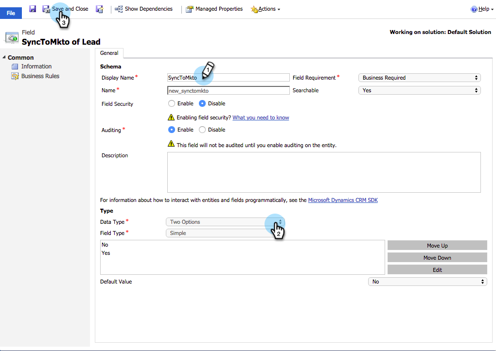
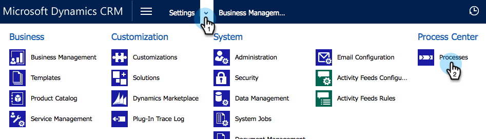

# 建立自訂Dynamics同步篩選器 {#create-a-custom-dynamics-sync-filter}

不想將您Dynamics CRM中的所有專案同步至Marketo嗎？ 別擔心！ Marketo可讓您設定同步篩選器，並僅同步部分記錄。

## 概觀 {#overview}

若要設定Dynamics同步篩選器：

1. 為任何物件（銷售機會、連絡人、帳戶、機會和其他自訂實體）在您的Dynamics CRM中建立名為new_synctomkto的自訂兩個選項（布林值）欄位。
1. 將此欄位指定為「是/否」值，或保留空白。

>[!NOTE]
>
>您必須在Dynamics CRM (而非您的資料庫或Marketo)中進行這些變更。

Marketo會在自動背景同步期間尋找此欄位，並根據此邏輯決定要同步處理的記錄：

| 欄位值 | 同步至Marketo？ |
|---|---|
| 欄位不存在 | 是 |
| 欄位是空的 | 是 |
| 欄位的值是 | 是 |
| 欄位的值否 | 否 |

>[!CAUTION]
>
>告知Marketo略過記錄的唯一方法是明確將欄位值設為 **否**. 即使欄位值為空，Marketo仍會透過同步記錄。

>[!PREREQUISITES]
>
>安裝最新版的Marketo外掛程式（3.0.0.1或更新版本）。 前往「Marketo >管理員> Microsoft Dynamics >下載Marketo解決方案」。

## 建立SyncToMkto欄位 {#create-synctomkto-field}

1. 登入Dynamics CRM。 按一下 **設定** 然後按一下 **自訂**.

   

1. 按一下 **自訂系統**.

   

1. 按一下  旁邊 **實體**.

   

1. 按一下  旁邊 **銷售機會** 並選取 **欄位**. 然後按一下 **新增**.

   

1. 輸入 **SyncToMkto** 在 **顯示名稱** 欄位並選取 **兩個選項** 作為 **資料型別**. 然後按一下 **儲存並關閉**.

   

   >[!NOTE]
   >
   >為此欄位選擇任何顯示名稱，但「名稱」欄位必須完全符合 **new_synctomkto**. 您必須使用 **新** 作為預設首碼。 如果您已變更預設值，請前往此處 [重設自訂欄位名稱的預設首碼](/help/marketo/product-docs/crm-sync/microsoft-dynamics-sync/create-a-custom-dynamics-sync-filter/set-a-default-custom-field-prefix.md). 建立新欄位後，您可以將其變更回。

   >[!NOTE]
   >
   >如果您設定了非同步工作流程，記錄會取得您在欄位中設定的預設SyncToMkto值，並在工作流程完成執行幾秒後取得正確的值。 如果預設值設為「是」，這些記錄將在Marketo中建立，然後過時。 使用 **否** 作為預設值，以避免此情況。

1. 重複此程式並建立 **SyncToMkto** 任何其他要限制同步處理的實體的欄位，例如連絡人、帳戶、商機和自訂實體。

## 在Marketo中選取篩選器 {#select-the-filter-in-marketo}

即使您已完成初始同步，請前往並選取要與Marketo同步的欄位。

1. 前往「管理員」並選取「 」 **Microsoft Dynamics**.

   

1. 按一下 **編輯** 欄位同步詳細資訊。

   

1. 向下捲動至欄位並勾選它。 實際名稱必須是new_synctomkto，但「顯示名稱」可以是任何內容。 按一下 **儲存**.

   

很好，現在您已啟用Marketo的同步篩選器。

## 建立Dynamics工作流程以自動指派同步篩選器值 {#create-a-dynamics-workflow-to-assign-sync-filter-values-automatically}

您一律可以手動指派值給記錄的SyncToMkto欄位。 但是為什麼不利用Dynamics工作流程的強大功能，在建立或更新記錄時自動指派值給SyncToMkto欄位？

>[!NOTE]
>
>您無法在資料庫層級執行此操作。 這必須在CRM中手動或使用工作流程完成。
>
>Dynamics工作流程僅適用於日後建立的新記錄，不適用於歷史資料。 使用批次更新來移動現有記錄。

1. 前往Dynamics CRM。 按一下 **設定** 然後按一下 **程式**.

   

1. 按一下 **新增**.

   

1. 輸入工作流程的名稱，然後選取 **工作流程** 作為類別和 **銷售機會** 作為實體。 然後按一下 **確定**.

   

1. 建立規則以將真或假值指派給 **SyncToMkto** 根據貴組織偏好設定的欄位。 按一下 **儲存並關閉**.

   

   >[!NOTE]
   >
   >按一下後定義預設動作 **新增步驟** 以新增檢查條件。 這會設定您不想要同步到的記錄 **否**. 否則，它們將會同步。

1. 選取工作流程並按一下 **啟動**.

   

   >[!TIP]
   >
   >另請參閱 [電子郵件地址的自訂同步篩選規則](/help/marketo/product-docs/crm-sync/microsoft-dynamics-sync/create-a-custom-dynamics-sync-filter/custom-sync-filter-rules-for-an-email-address.md) 設定規則，只同步擁有電子郵件地址之人員的記錄。

## 同步篩選器詳細資料 {#sync-filter-details}

以下是一些我們認為您應知道的實施詳細資料：

1. 啟動同步作業

   當 **SyncToMkto** 值變更自 **否** 至 **是**，Dynamics會立即通知Marketo開始同步處理此記錄。 如果記錄已存在，Marketo會更新記錄。 否則，Marketo會建立記錄。

   >[!TIP]
   >
   >A `Create [StartSync]` 發生此情況時，會將作業新增至Marketo記錄檔。

1. 停止同步作業

   當記錄將其SyncToMkto值從「是」變更為「否」時，Marketo會收到停止同步處理此記錄的通知。 但記錄並未刪除，而是停止取得更新並過時。

>[!MORELIKETHIS]
>
>* [Microsoft Dynamics同步篩選器：合格](/help/marketo/product-docs/crm-sync/microsoft-dynamics-sync/create-a-custom-dynamics-sync-filter/microsoft-dynamics-sync-filter-qualify.md)
>* [Microsoft Dynamics同步篩選器：合併](/help/marketo/product-docs/crm-sync/microsoft-dynamics-sync/create-a-custom-dynamics-sync-filter/microsoft-dynamics-sync-filter-merge.md)
>* [電子郵件地址的自訂同步篩選規則](/help/marketo/product-docs/crm-sync/microsoft-dynamics-sync/create-a-custom-dynamics-sync-filter/custom-sync-filter-rules-for-an-email-address.md)
