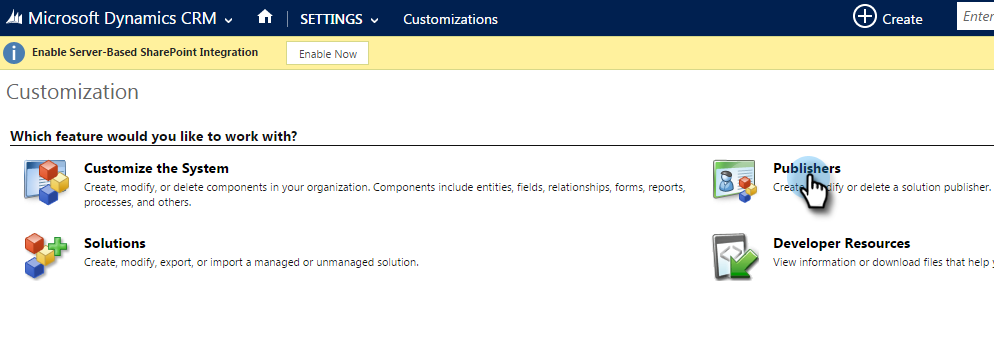
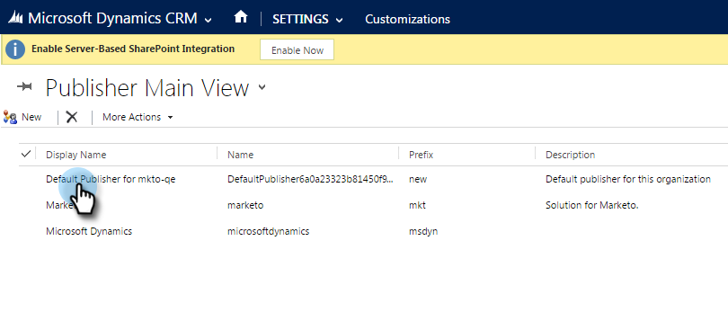

# 設定預設自訂欄位首碼{#set-a-default-custom-field-prefix}

自訂欄位的預設Microsoft Dynamics首碼必須為&#x200B;**new**,Marketo專屬欄位才能正確同步。 以下是如何變更預設首碼。

1. 轉至「設定」並選擇「**自定義」。**

   

1. 按一下「**發行者**」。

   

1. 從清單中選取預設的發行者。

   

1. 將前置詞更改為&#x200B;**new**。 按一下「保存並關閉」(**Save and Close)。**

   

1. 前往「設定>解決方案」以發佈自訂設定。

   

1. 按一下&#x200B;**發佈所有自定義**。

   

1. 現在，請建立您的自訂欄位。 完成後，請將前置詞還原為原始前置詞。
