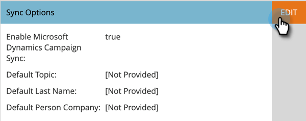

# 啟用行銷活動同步 {#enable-campaign-sync}

此選項可讓Marketo從[!DNL MS Dynamics]行銷活動新增及移除成員。

>[!PREREQUISITES]
>
>更新至Marketo適用的[!DNL Dynamics]外掛程式最新版本。

>[!NOTE]
>
>**需要管理員權限**

1. 在您的&#x200B;**[!UICONTROL My Marketo]**&#x200B;中，按一下&#x200B;**[!UICONTROL Admin]**。

   

1. 按一下「**[!UICONTROL Microsoft Dynamics]**」。

   

1. 在&#x200B;**[!UICONTROL Sync Options]**&#x200B;底下，按一下&#x200B;**[!UICONTROL Edit]**。

   

1. 選取&#x200B;**[!UICONTROL Enable Microsoft Dynamics Campaign Sync]**&#x200B;核取方塊並按一下&#x200B;**[!UICONTROL Save]**。

   

給同步處理一些時間從[!DNL Microsoft Dynamics]提取資料。

>[!NOTE]
>
>重設[!DNL Dynamics] Campaign同步核取方塊將會重新整理所有先前同步的Campaign資料，以及與[!DNL Dynamics]中行銷清單的關聯。
