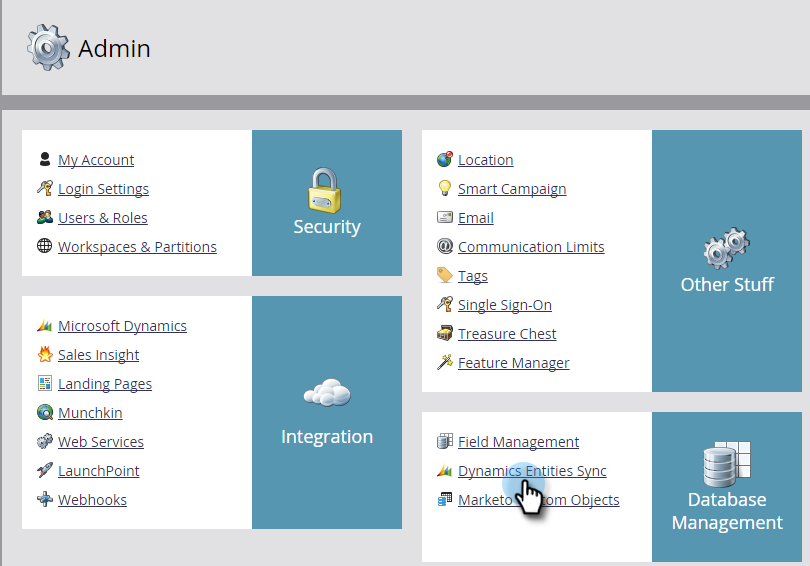

# Microsoft Dynamics Sync:自訂實體同步{#microsoft-dynamics-sync-custom-entity-sync}

如果您需要啟用初始自訂實體同步，讓Dynamics的資料在Marketo可用，請以下說明如何進行。

>[!NOTE]
>
>**需要管理員權限**

>[!PREREQUISITES]
>
>若要使用自訂物件，它必須與Dynamics中的[lead](/help/marketo/product-docs/crm-sync/microsoft-dynamics-sync/microsoft-dynamics-sync-details/microsoft-dynamics-sync-lead-sync.md)、[contact](/help/marketo/product-docs/crm-sync/microsoft-dynamics-sync/microsoft-dynamics-sync-details/microsoft-dynamics-sync-contact-sync.md)或[account](/help/marketo/product-docs/crm-sync/microsoft-dynamics-sync/microsoft-dynamics-sync-details/microsoft-dynamics-sync-account-sync.md)物件相關聯。

>[!CAUTION]
>
>在開始自訂實體的同步之前，請確定初始同步已完成（將會透過電子郵件通知您）。

1. 前往「管理員」區段。

   

1. 按一下&#x200B;**禁用同步**&#x200B;可暫時禁用標準全局同步。

   

1. 安裝支援自訂實體同步的Microsoft Dynamics版本（2_0_0_2之後）。 請參閱[MarketoPlugin Releases for MIcrosoft Dynamics](/help/marketo/product-docs/crm-sync/microsoft-dynamics-sync/marketo-plugin-releases-for-microsoft-dynamics.md)。

1. 為「Marketo同步用戶」授予您計畫同步的任何實體的讀權限。

1. 在「資料庫管理」下，按一下&#x200B;**Dynamics Entities Sync**&#x200B;連結。

   

1. 按一下&#x200B;**同步模式**&#x200B;連結可以轉換可用的自定義實體清單。

   

1. 清單同步後，選擇要同步的欄位和要用作智慧清單中[constraints](/help/marketo/product-docs/core-marketo-concepts/smart-lists-and-static-lists/using-smart-lists/add-a-constraint-to-a-smart-list-filter.md)和／或觸發器的欄位。 完成後，按一下「啟用同步」。****

   

1. 重新啟用全域同步。

   

   >[!NOTE]
   >
   >Marketo僅支援連結至一或兩層深之標準實體的自訂實體。

   >[!NOTE]
   >
   >實體名稱最多可包含&#x200B;**33個字元**。

你好！
