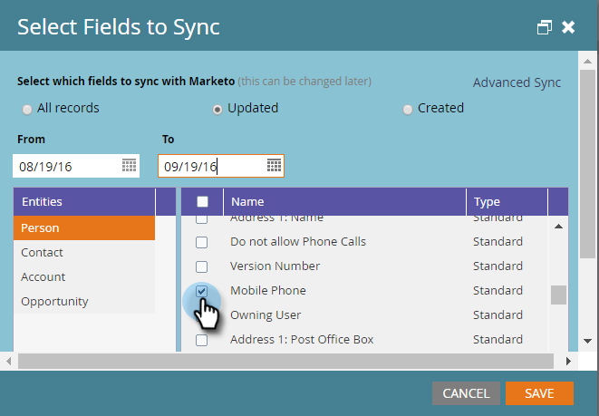

# 將「快速同步」與Microsoft Dynamics用於新的自定義欄位{#use-quick-sync-with-microsoft-dynamics-for-a-new-custom-field}

行銷或銷售部門需要新的欄位。 或者，您可能在初始欄位選擇中忘記了一個。 或者，您的需求已經改變。 無論如何，您都可以使用「快速同步」來重新同步特定欄位。

通常，您會使用「快速同步」新增欄位，並重新整理值。 不過，您可能會想要同步現有欄位。 您可以根據更新或建立的日期範圍來限制欄位同步。 如需詳細資訊，請參閱下方的[進階同步選項](#Advanced_Sync_Options)。

快速同步可以同步空值。 例如，如果您使用值A和B，並將Dynamics中的B值變更為null，則會將null值同步至Marketo。

## 所有記錄的快速同步{#quick-sync-for-all-records}

以下是如何使用「快速同步」重新同步新欄位。

1. 在Marketo，按一下&#x200B;**管理**。

   

1. 按一下&#x200B;**Microsoft Dynamics**。

   

1. 在欄位同步詳細資訊中，按一下&#x200B;**編輯**。

   

1. 選擇要快速同步的欄位，然後按一下&#x200B;**保存**。

   

   >[!NOTE]
   >
   >您可以從多個實體中選取欄位。

1. 同步完成時，您會收到通知。

   

   >[!CAUTION]
   >
   >同步與其他同步並排運行，並且根據資料庫的大小，完成同步可能需要很長的時間。 當欄位位於同步佇列中時，您無法取消選取它。

## 高級同步選項{#advanced-sync-options}

如果您想要同步現有欄位，但僅針對有限的資料集進行同步，該怎麼辦？ 這是方法。

1. 清除現有欄位的複選框。 按一下&#x200B;**保存**。

   

1. 再次開啟快顯視窗並重新選取欄位。

   

1. 按一下&#x200B;**高級同步**。

   

1. 選擇&#x200B;**Updated**&#x200B;並使用日期選擇器選擇日期範圍。 按一下&#x200B;**保存**。

   

   只有8/19/16和9/19/16之間更新的記錄才會為欄位快速同步。

## 修正不同步欄位{#fixing-out-of-sync-fields}

在「動態」和「Marketo」欄位不同步的罕見情況下，有一種快速且簡單的方法可重新同步它們。

1. 取消選擇該欄位，然後按一下「保存」。****

   

1. 重新選擇該欄位，然後按一下&#x200B;**保存**。 就這樣！

   

   這應該能解決問題！
