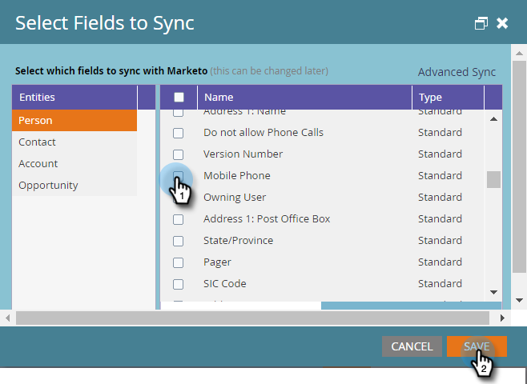

# 對新的自訂欄位使用與Microsoft Dynamics的快速同步 {#use-quick-sync-with-microsoft-dynamics-for-a-new-custom-field}

行銷或銷售部門需要新欄位。 或者，你可能在最初的欄位選擇中忘了一個。 或者，你的需求改變了。 在任何情況下，您都可以使用快速同步來重新同步特定欄位。

通常，您會使用快速同步來添加新欄位並刷新值。 不過，在某些情況下，您可能會想要同步現有欄位。 您可以根據更新或建立的日期範圍來限制欄位同步。 請參閱 [進階同步選項](#Advanced_Sync_Options) 詳情請參閱下文。

快速同步可以同步空值。 例如，如果您使用值A和B，並將Dynamics中的B值變更為null，則會將null值同步至Marketo。

## 所有記錄的快速同步 {#quick-sync-for-all-records}

以下說明如何使用快速同步來重新同步新欄位。

1. 在Marketo中，按一下 **管理**.

   

1. 按一下 **Microsoft Dynamics**.

   

1. 在欄位同步詳細資訊上，按一下 **編輯**.

   

1. 選取要快速同步的欄位，然後按一下 **儲存**.

   

   >[!NOTE]
   >
   >您可以從多個實體中選取欄位。

1. 同步完成時，您會收到通知。

   

   >[!CAUTION]
   >
   >同步會與其他同步並排執行，而且視資料庫的大小而定，完成同步可能需要很長的時間。 當欄位處於同步佇列中時，您無法取消選取該欄位。

## 進階同步選項 {#advanced-sync-options}

如果您想同步現有欄位，但只對有限的資料集同步，該怎麼辦？ 這是方法。

1. 清除現有欄位的核取方塊。 按一下 **儲存**.

   

1. 再次開啟快顯視窗並重新選取欄位。

   

1. 按一下 **進階同步**.

   

1. 選擇 **已更新** 和使用日期選擇器選取日期範圍。 按一下 **儲存**.

   

   欄位的「快速同步」只會同步8/19/16至9/19/16之間更新的記錄。

## 修正不同步欄位 {#fixing-out-of-sync-fields}

在Dynamics和Marketo欄位不同步的罕見情況下，有快速且簡單的方式可重新同步它們。

1. 取消選取欄位，然後按一下 **儲存**.

   

1. 重新選取欄位，然後按一下 **儲存**. 僅此而已！

   

   那應該能解決！
