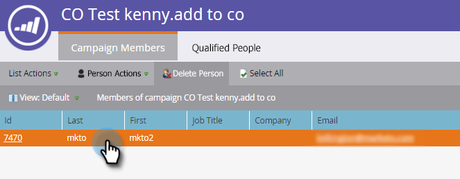

# 在Microsoft Dynamics {#create-a-contact-in-microsoft-dynamics}中建立連絡人

1. 選擇您要在Dynamics中作為聯繫人建立的僅限Marketo的人員（Microsoft類型為空）。

   

1. 按一下「**人員操作**&#x200B;和&#x200B;**Microsoft**」，然後選擇「將人員同步到Microsoft **」。**

   

1. 按一下「同步為」(**Sync As)**&#x200B;並選擇「聯繫」(**Contact)**。 按一下&#x200B;**立即運行**。

   

   >[!NOTE]
   >
   >使用「將人員同步至Microsoft」流動動作（僅在觸發促銷活動中）時，銷售機會／連絡人會在Dynamics中即時建立。

1. Marketo將Dynamics中的銷售線索記錄限定為與Dynamics中任何帳戶無關的聯繫人。

   

1. 現在，在智慧型促銷活動篩選器中使用「同步為」限制時，您可以選取&#x200B;**Contact**。

   
