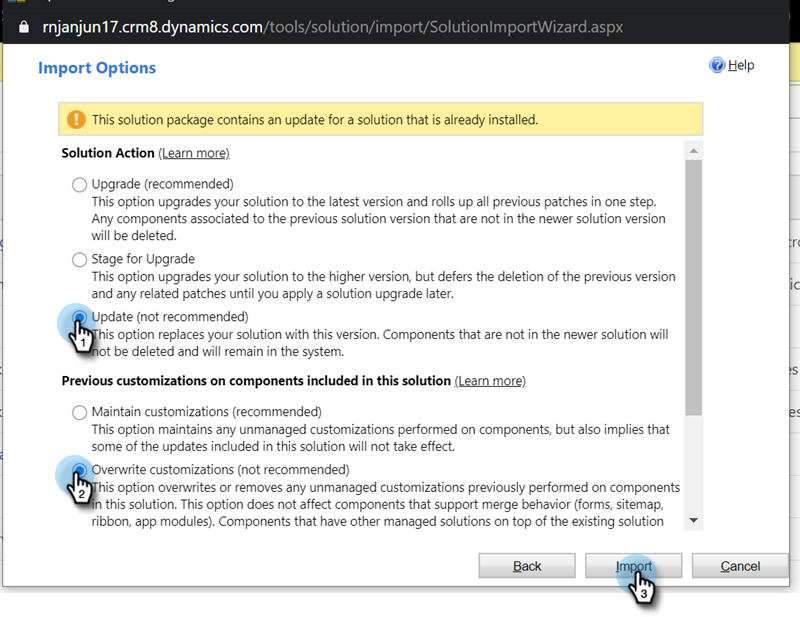

# Microsoft Dynamics MSI的增效模組版本{#plug-in-releases-for-microsoft-dynamics-msi}

當您第一次同步至Microsoft Dynamics時，請下載並安裝Marketo Sales Insight(MSI)的最新版本外掛程式。 Marketo會定期更新這些外掛程式，讓您回到相同位置下載新版本。

請[下載與Dynamics版本對應的最新外掛程式](http://docs.marketo.com/x/LoJo)。

>[!NOTE]
>
>這些版本適用於內部部署版本和線上版本的Dynamics。

## 更新您的MSI解決方案{#updating-your-msi-solution}

1. 匯入解決方案的最新版本，而不是Dynamics CRM的現有版本(例如：如果您的Dynamics CRM有1.4版，而最新版是1.5版，您應匯入&#x200B;*over* 1.4版。
1. 您會看到下列快顯視窗。 選擇&#x200B;**Update**&#x200B;和&#x200B;**Overwrite customization**&#x200B;選項，然後按一下&#x200B;**Import**。

   

## 版本更新{#version-updates}

<table> 
 <colgroup> 
  <col> 
  <col> 
  <col> 
 </colgroup> 
 <tbody> 
  <tr> 
   <th colspan="1">版本</th> 
   <th colspan="1">發行日期</th> 
   <th colspan="1">附註</th> 
  </tr> 
  <tr> 
   <td colspan="1">07/20/20</td> 
   <td colspan="1">2.0.0.20</td> 
   <td colspan="1">錯誤修正：為非同步記錄添加驗證消息</td> 
  </tr> 
  <tr> 
   <td colspan="1">06/12/20</td> 
   <td colspan="1">2.0.0.19</td> 
   <td colspan="1">
錯誤修正：在MSD API配置中隱藏MSI密碼
</td> 
  </tr> 
  <tr> 
   <td colspan="1">05/26/20</td> 
   <td colspan="1">2.0.0.18</td> 
   <td colspan="1">
錯誤修正：若要變更顯示MSI按鈕的MSI角色ID驗證
</td> 
  </tr> 
  <tr> 
   <td colspan="1">05/21/20</td> 
   <td colspan="1">2.0.0.17</td> 
   <td colspan="1">
錯誤修正：取消隱藏擁有者欄位，並將欄位設為非必填欄位
</td> 
  </tr> 
  <tr> 
   <td colspan="1">04/28/20</td> 
   <td colspan="1">2.0.0.16</td> 
   <td colspan="1">
錯誤修正：刪除MSD CRM站點地圖設定連結相關性
</td> 
  </tr> 
 </tbody> 
</table>

