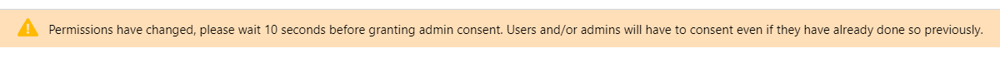
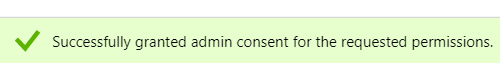

# 向Azure註冊應用程式以取得您的用戶端ID/應用程式ID {#register-an-app-with-azure-to-acquire-your-client-id-app-id}

Azure Active Directory將您的本地目錄擴展到雲中，提供對MS Dynamics 365 CRM的支援，並提供內部部署ADFS驗證。

## 註冊新應用程式 {#registering-a-new-app}

1. [登入](https://login.microsoftonline.com/){target=&quot;_blank&quot;}使用具有管理員權限的帳戶，傳送至Microsoft Azure管理入口網站。 您也可以透過Office 365管理中心，借由展開 **管理** 項目（在左側導覽窗格中），並選擇 **Azure AD**.

   >[!CAUTION]
   >
   >您必須在與要向註冊應用程式的訂閱相同的Office 365訂閱中使用帳戶。

   >[!NOTE]
   >
   >如果您沒有Azure帳戶，您可以 [註冊](https://azure.microsoft.com/en-us/free/){target=&quot;_blank&quot;}（若為）。 請參閱Microsoft的檔案，或聯絡您的Microsoft代表以取得詳細資訊。 建立Azure帳戶後，您就可以依照下列程式註冊一或多個應用程式。
   >
   >
   >如果您有Azure帳戶，但Azure訂閱中沒有Microsoft Dynamics 365的Office 365訂閱，請遵循 [這些指示](https://msdn.microsoft.com/office/office365/howto/setup-development-environment#bk_CreateAzureSubscription){target=&quot;_blank&quot;}以關聯兩個帳戶。

1. 尋找並按一下 **Azure Active Directory** 的下一頁。

   

1. 在管理下，按一下 **應用程式註冊**.

   

1. 按一下 **新註冊** 頁面頂端。

   

1. 輸入應用程式的名稱，選擇您適用的帳戶類型，然後輸入重新導向URL。 然後按一下 **註冊** 頁面底部。

   

1. 現在，您應該會在 **應用程式註冊** 標籤。

   

## 設定應用程式權限 {#configuring-app-permissions}

1. 在 **應用程式註冊** 頁簽，按一下要配置權限的應用。

   

1. 在管理下，按一下 **API權限**.

   

1. 按一下 **新增權限** 按鈕。

   

1. 選擇 **Dynamics CRM**.

   

1. 檢查 **以組織使用者身分存取通用資料服務****** 框，然後按一下 **新增權限。**

   

1. 成功新增權限後，請至少等候10秒。

   

1. 按一下 **授予管理員同意** 按鈕。

   

1. 按一下 **是** 確認。

   

   你完了！

   
