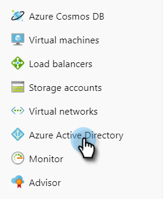

# 使用Azure註冊應用程式以取得您的使用者端ID/應用程式ID {#register-an-app-with-azure-to-acquire-your-client-id-app-id}

Azure Active Directory將您的內部部署目錄延伸至雲端，支援具有內部部署ADFS驗證的MS Dynamics 365 CRM。

## 註冊新應用程式 {#registering-a-new-app}

1. [登入](https://login.microsoftonline.com/){target="_blank"} 使用具有管理員許可權的帳戶移至Microsoft Azure管理入口網站。 Microsoft您也可以透過Office 365系統管理中心，透過展開 **管理員** 專案，並選取 **Azure AD**.

   >[!CAUTION]
   >
   >您必須使用與您要註冊應用程式之帳戶相同的Office 365訂閱帳戶。

   >[!NOTE]
   >
   >如果您沒有Azure帳戶，可以 [註冊](https://azure.microsoft.com/en-us/free/){target="_blank"} 就一個。 如需詳細資訊，請參閱Microsoft檔案或聯絡Microsoft代表。 建立Azure帳戶後，您可以使用下列程式註冊一或多個應用程式。
   >
   >
   >如果您有Azure帳戶，但您的Azure訂閱中無法使用具有Microsoft Dynamics 365的Office 365訂閱，請遵循 [這些指示](https://msdn.microsoft.com/office/office365/howto/setup-development-environment#bk_CreateAzureSubscription){target="_blank"} 以關聯兩個帳戶。

1. 尋找並按一下 **Azure Active Directory** 左側導覽窗格中。

   

1. 在管理底下，按一下 **應用程式註冊**.

   

1. 按一下 **新註冊** ，位於頁面頂端。

   

1. 輸入應用程式的名稱、選擇適用的帳戶型別，然後輸入重新導向URL。 然後按一下 **註冊** 位於頁面底部。

   

1. 您現在應該會在以下位置看到您的應用程式： **應用程式註冊** 標籤。

   

## 設定應用程式許可權 {#configuring-app-permissions}

1. 在 **應用程式註冊** 索引標籤中，按一下您要為其設定許可權的應用程式。

   

1. 在管理底下，按一下 **API許可權**.

   

1. 按一下 **新增許可權** 按鈕。

   

1. 選擇 **Dynamics CRM**.

   

1. 檢查 **以組織使用者身分存****Common Data Service** 方塊，然後按一下 **新增許可權。**

   

1. 成功新增許可權後，請至少等待10秒。

   

1. 按一下 **授予管理員同意** 按鈕。

   

1. 按一下 **是** 以確認。

   

   而且您已完成！

   
