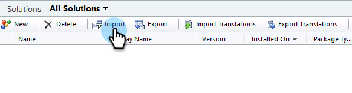

# 第1步（共3步）:安裝Marketo解決方案（2011年內部部署） {#step-of-install-the-marketo-solution-on-premises}

您必須先在Dynamics中安裝Microsoft解決方案，才能同步Marketo Dynamics內部部署和Marketo。

>[!NOTE]
>
>將Marketo同步至CRM後，若不取代執行個體，就無法執行新同步。

>[!PREREQUISITES]
>
>您必須 [面向Internet的部署](https://www.microsoft.com/en-us/download/confirmation.aspx?id=41701) (IFD)與 [Active Directory聯合身份驗證服務](https://msdn.microsoft.com/en-us/library/bb897402.aspx) 2.0、2.1或3.0(ADFS)。 **附註**:當您按一下連結時，IFD文檔會自動下載。
>
>[下載Marketo銷售機會管理解決方案](/help/marketo/product-docs/crm-sync/microsoft-dynamics-sync/sync-setup/download-the-marketo-lead-management-solution.md) 開始之前。

>[!NOTE]
>
>**需要Dynamics管理員權限。**
>
>您需要CRM管理員權限才能執行此同步。

1. 登入 **動態**，選取 **設定** 的上界。

   

1. 選擇 **解決方案** 在樹上。

   

1. 按一下 **匯入**.

   

1. 按一下 **瀏覽**. 選擇您的Marketo銷售機會管理解決方案 [已下載](/help/marketo/product-docs/crm-sync/microsoft-dynamics-sync/sync-setup/download-the-marketo-lead-management-solution.md). 按一下 **下一個**.

   

1. 檢視解決方案資訊，然後按一下 **查看解決方案包詳細資訊**.

   

1. 檢查完所有詳細資訊後，按一下 **關閉**.

   

1. 返回「解決方案資訊」頁面，按一下 **下一個**.

   

1. 確認已勾選SDK訊息選項核取方塊。 按一下 **下一個**.

   

   >[!TIP]
   >
   >您必須啟用瀏覽器上的快顯視窗，才能完成安裝程式。

1. 現在等待匯入完成。 起來，做些伸展。

   

1. 按一下 **關閉**.

   >[!NOTE]
   >
   >您可能會看到一則訊息，指出「Marketo銷售機會管理已完成並出現警告」。 這是完全預期的。

   

1. Marketo Lead Management現在會顯示在 **所有解決方案** 頁面。

   

1. 選取「Marketo銷售機會管理」 ，然後按一下 **發佈所有自訂。**

   

是不是太糟了？ 來吧，我會帶你過去。

>[!CAUTION]
>
>停用任何Marketo SDK傳訊程式都會導致安裝中斷！

>[!MORELIKETHIS]
>
>[第2步（共3步）:在Dynamics中設定Marketo同步使用者（2011年內部部署）](/help/marketo/product-docs/crm-sync/microsoft-dynamics-sync/sync-setup/microsoft-dynamics-2011-on-premises/step-2-of-3-set-up.md)
