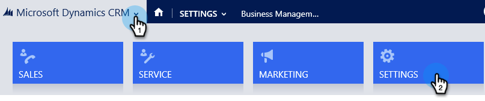

# Step 1 of 3: Configure Sync User for Marketo (2015 On-Prem) {#step-of-configure-sync-user-for-marketo-on-premises-2015}

您必須先在Dynamics中安裝Microsoft解決方案，才能將Marketo Dynamics 2015內部部署與Marketo同步。

>[!NOTE]
>
>After you sync Marketo to a CRM, you cannot sync a new CRM to the existing Marketo instance.

>[!PREREQUISITES]
>
>If you&#39;re using Microsoft Dynamics On-Premise, you must have [Internet Facing Deployment](https://www.microsoft.com/en-us/download/confirmation.aspx?id=41701) (IFD) with [Active Directory Federation Services](https://msdn.microsoft.com/en-us/library/bb897402.aspx) 2.0+ (ADFS) configured. Note: The IFD document downloads automatically when you click the link.
>
>[Download the Marketo Lead Management Solution](/help/marketo/product-docs/crm-sync/microsoft-dynamics-sync/sync-setup/download-the-marketo-lead-management-solution.md) before you start.

>[!NOTE]
>
>**Dynamics Admin Permissions required.**
>
>You need CRM administrator privileges to perform this sync.

1. 登入 **動態。** 按一下 **Microsoft Dynamics CRM** 下拉式功能表，然後選取 **設定**.

   

1. 在 **設定**，選取 **解決方案**.

   

1. 按一下 **匯入**.

   

1. 按一下 **瀏覽** 並選擇您的解決方案 [已下載](/help/marketo/product-docs/crm-sync/microsoft-dynamics-sync/sync-setup/download-the-marketo-lead-management-solution.md). 按一下 **下一個**.

   

1. 檢視解決方案資訊，然後按一下 **查看解決方案包詳細資訊**.

   

1. 檢查完所有詳細資訊後，按一下 **關閉**.

   

1. Back on the Solution Information page, click **Next**.

   

1. 確認已選取SDK選項核取方塊。 按一下 **匯入**.

   

1. 等待匯入完成。

   >[!TIP]
   >
   >您必須啟用瀏覽器上的快顯視窗，才能完成安裝程式。

   

1. 下載記錄檔（如果需要），然後按一下 **關閉**.

   >[!NOTE]
   >
   >You may see a message saying &quot;Marketo Lead Management completed with warning&quot;. 這是完全預期的。

   

1. Marketo Lead Management現在會顯示在 **所有解決方案** 頁面。

   

1. 選取Marketo解決方案，然後按一下 **發佈所有自訂**.

   

   五！ 安裝已完成。

   >[!CAUTION]
   >
   >停用任何Marketo SDK傳訊程式都會導致安裝中斷！

   >[!MORELIKETHIS]
   >
   >[安裝Marketo for Microsoft Dynamics 2015內部部署步驟2（共3個）](/help/marketo/product-docs/crm-sync/microsoft-dynamics-sync/sync-setup/connecting-to-legacy-versions/step-2-of-3-set-up-2015.md)
