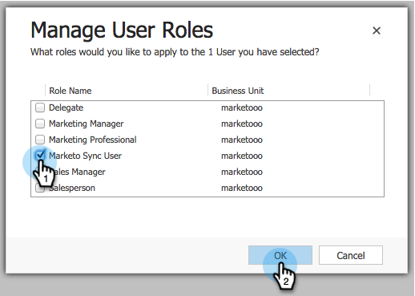
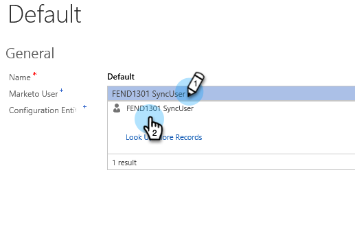

# 步驟3之2：設定Marketo的同步使用者（2013內部部署） {#step-of-configure-sync-user-for-marketo-on-premises}

完成先前步驟的偉大工作，讓我們繼續探討這個問題。

>[!PREREQUISITES]
>
>[步驟3之1：在 [!DNL Dynamics] （2013年內部部署）中安裝Marketo解決方案](/help/marketo/product-docs/crm-sync/microsoft-dynamics-sync/sync-setup/connecting-to-legacy-versions/step-1-of-3-install-2013.md)

## 指派同步使用者角色 {#assign-sync-user-role}

僅將Marketo同步使用者角色指派給Marketo同步使用者。 您不需要將其指派給任何其他使用者。

>[!NOTE]
>
>這適用於Marketo外掛程式版本4.0.0.14和更新版本。 對於舊版，所有使用者都必須擁有同步使用者角色。 若要升級Marketo，請參閱[升級 [!DNL Microsoft Dynamics]](/help/marketo/product-docs/crm-sync/microsoft-dynamics-sync/sync-setup/update-the-marketo-solution-for-microsoft-dynamics.md)的Marketo解決方案。

>[!IMPORTANT]
>
>同步處理使用者[的語言設定應該設定為英文](https://learn.microsoft.com/en-us/power-platform/admin/enable-languages){target="_blank"}。

1. 在&#x200B;**[!UICONTROL Settings]**&#x200B;底下，按一下&#x200B;**[!UICONTROL Administration]**。

   

1. 選擇「**[!UICONTROL Users]**」。

   

1. 您將會在這裡看到使用者清單。 選取您的專用Marketo Sync使用者或連絡您的[Active Directory Federation Services (AFDS)](https://msdn.microsoft.com/en-us/library/bb897402.aspx){target="_blank"}系統管理員，以建立[專用於Marketo](https://blogs.technet.com/b/askpfeplat/archive/2014/04/21/introduction-to-active-directory-federation-services-ad-fs-alternateloginid-feature.aspx){target="_blank"}的新使用者。

   

1. 選取同步使用者。 按一下並選取&#x200B;**[!UICONTROL Manage Roles]**

   

1. 檢查&#x200B;**[!UICONTROL Marketo Sync User]**&#x200B;並按一下&#x200B;**[!UICONTROL OK]**。

   

   >[!TIP]
   >
   >如果您沒有看到角色，請返回3[的](/help/marketo/product-docs/crm-sync/microsoft-dynamics-sync/sync-setup/connecting-to-legacy-versions/step-1-of-3-install-2013.md){target="_blank"}步驟1並匯入解決方案。

   >[!NOTE]
   >
   >同步使用者在您的CRM中所做的任何更新將&#x200B;_不會_&#x200B;同步回Marketo。

## 設定Marketo解決方案 {#configure-marketo-solution}

即將完成！ 在前往下一篇文章之前，我們僅有最後幾項的設定。

1. 在&#x200B;**[!UICONTROL Settings]**&#x200B;底下，按一下&#x200B;**[!UICONTROL Marketo Config]**。

   

   >[!NOTE]
   >
   >如果缺少&#x200B;**[!UICONTROL Marketo Config]**，請嘗試重新整理頁面。 如果問題仍然存在，請[再次發佈Marketo解決方案](/help/marketo/product-docs/crm-sync/microsoft-dynamics-sync/sync-setup/connecting-to-legacy-versions/step-1-of-3-install-2013.md)，或嘗試登出再重新登入。

1. 按一下「**[!UICONTROL Default]**」。

   

1. 按一下&#x200B;**[!UICONTROL Marketo User]**&#x200B;欄位並選取同步使用者。

   

1. 按一下右下角的以儲存變更。

   

1. 按一下「**[!UICONTROL Publish All Customizations]**」。

   

## 繼續進行步驟3之前 {#before-proceeding-to-step}

* 若要限制同步處理的記錄數目，請立即[設定自訂同步處理篩選器](/help/marketo/product-docs/crm-sync/microsoft-dynamics-sync/create-a-custom-dynamics-sync-filter.md)。
* 執行[驗證 [!DNL Microsoft Dynamics] 同步](/help/marketo/product-docs/crm-sync/microsoft-dynamics-sync/sync-setup/validate-microsoft-dynamics-sync.md)程式。 它可驗證您的初始設定是否正確完成。
* 在[!DNL Microsoft Dynamics] CRM中登入Marketo Sync User。

做得好！

>[!MORELIKETHIS]
>
>[步驟3之3：連線Marketo和 [!DNL Dynamics] （2013年內部部署）](/help/marketo/product-docs/crm-sync/microsoft-dynamics-sync/sync-setup/connecting-to-legacy-versions/step-3-of-3-connect-2013.md)
