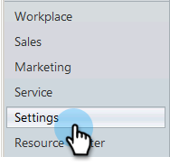
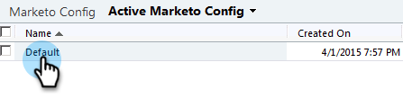

# 第2步（共3步）:在Dynamics中設定Marketo同步使用者（2011年內部部署） {#step-of-set-up-marketo-sync-user-in-dynamics-on-premises}

完成上述步驟非常好，讓我們繼續完成。

>[!PREREQUISITES]
>
>[第1步（共3步）:安裝Marketo解決方案（2011年內部部署）](/help/marketo/product-docs/crm-sync/microsoft-dynamics-sync/sync-setup/microsoft-dynamics-2011-on-premises/step-1-of-3-install.md)

## 分配同步用戶角色 {#assign-sync-user-role}

僅將Marketo同步使用者角色指派給Marketo同步使用者。 您不需要將其指派給任何其他使用者。

>[!NOTE]
>
>這適用於Marketo外掛程式4.0.0.14版和更新版本。 對於較舊版本，所有使用者都必須具有同步使用者角色。 若要升級Marketo，請參閱 [升級Microsoft Dynamics的Marketo解決方案](/help/marketo/product-docs/crm-sync/microsoft-dynamics-sync/sync-setup/update-the-marketo-solution-for-microsoft-dynamics.md).

>[!IMPORTANT]
>
>同步用戶的語言設定 [應設為英文](https://portal.dynamics365support.com/knowledgebase/article/KA-01201/en-us).

1. 在左下方功能表中，選取 **設定**.

   

1. 在樹中，選擇 **管理**.

   

1. 選擇 **使用者**.

   

1. 您會在此處看到使用者清單。 選取您專屬的Marketo同步使用者，或聯絡您的 [Active Directory聯合身份驗證服務(AFDS)](https://msdn.microsoft.com/en-us/library/bb897402.aspx) 管理員，以建立專屬於Marketo的新使用者。 按一下 **管理角色**.

   

1. 檢查 **Marketo同步使用者** 按一下 **確定**.

   

   >[!TIP]
   >
   >如果您沒有看見角色，請返回 [步驟1至3](/help/marketo/product-docs/crm-sync/microsoft-dynamics-sync/sync-setup/microsoft-dynamics-2011-on-premises/step-1-of-3-install.md) 並匯入解決方案。

   >[!NOTE]
   >
   >同步使用者在您的CRM中進行的任何更新都將 **not** 同步回Marketo。

## 設定Marketo解決方案 {#configure-marketo-solution}

快完成了！ 我們只有最後幾段配置，然後再轉到下一篇文章。

1. 選擇 **設定**. 然後選取 **Marketo設定** 在樹上。

   

   >[!NOTE]
   >
   >如果缺少Marketo設定，請嘗試重新整理頁面。 如果問題持續存在， [再次發佈Marketo解決方案](/help/marketo/product-docs/crm-sync/microsoft-dynamics-sync/sync-setup/microsoft-dynamics-2011-on-premises/step-1-of-3-install.md) 或登出再登入。

1. 按一下 **預設**.

   

1. 按一下 

   

1. 在快顯視窗中，選取同步使用者。 然後按一下 **確定**.

   

1. 按一下 **儲存** 以儲存變更。

   

1. 按一下 **發佈所有自訂**.

   

## 繼續執行步驟3之前 {#before-proceeding-to-step}

    *如果要限制同步的記錄數，請立即[設定自訂同步篩選器](/help/marketo/product-docs/crm-sync/microsoft-dynamics-sync/create-a-custom-dynamics-sync-filter.md)。
    *執行[驗證Microsoft Dynamics同步](/help/marketo/product-docs/crm-sync/microsoft-dynamics-sync/sync-setup/validate-microsoft-dynamics-sync.md)程式。 它會驗證您的初始設定是否正確執行。
    *在Microsoft Dynamics CRM中登入Marketo同步使用者。

幹得好！

>[!MORELIKETHIS]
>
>[第3步（共3步）:將Microsoft Dynamics與Marketo連線（2011年內部部署）](/help/marketo/product-docs/crm-sync/microsoft-dynamics-sync/sync-setup/microsoft-dynamics-2011-on-premises/step-3-of-3-connect.md)
